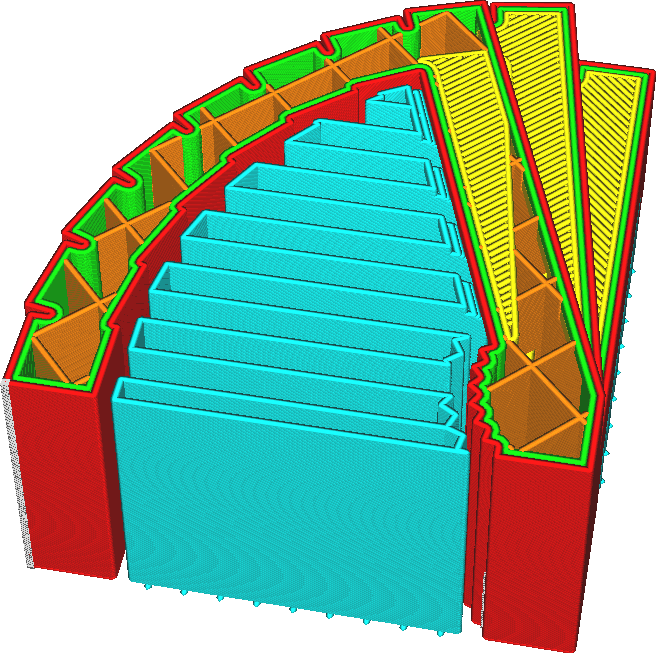

Vzdálenost linií podpěry
====
Tento parametr definuje vzdálenost mezi dvěma sousedními liniemi ve vzoru podpěry. Tento způsob nastavení hustoty podpěry může být intuitivnější než přizpůsobení hustoty podpěry, protože přímo upravuje vzdálenost, kterou musí linie podpěry přemostit.

Zmenšení vzdálenosti mezi liniemi podpěry má pozitivní i negativní účinky. Zde je několik vlivů, které je třeba zvážit:
* Povrch spočívající na této podpěře bude méně klesat, protože musí vyplnit kratší vzdálenost mezi dvěma podpůrnými liniemi.
* Podpěry budou silnější, což zlepší spolehlivost tisku.
* Je obtížnější odstranit podpěru kvůli zvýšené adhezní ploše.
* Tisk podpěry vyžaduje více materiálu.
* Tisk bude trvat déle.