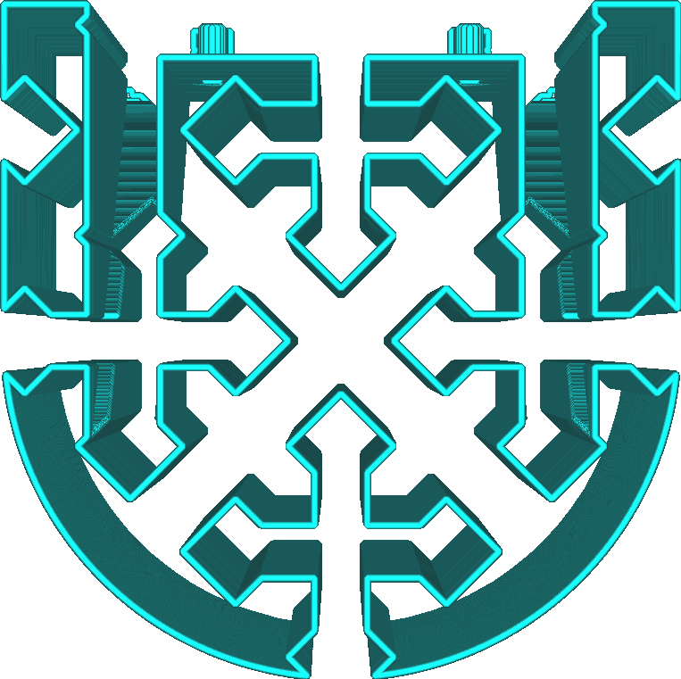
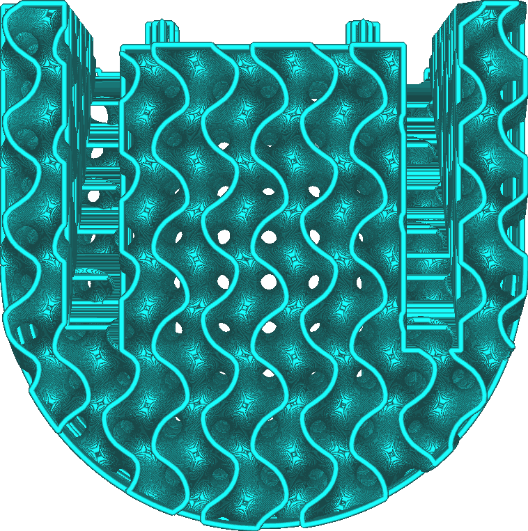

Vzor podpěry
====
Pomocí tohoto parametru můžete vybrat vzor, který bude použit k vyplnění objemu podpůrné struktury. Různé vzory mají různé silné a slabé stránky.

Lineární
----

Lineární vzor kreslí rovné linie. Linie jsou orientovány tak, aby nebyly nikdy kolmé na linie pláště, který musí podpírat (výchozí).
* Nejsnadnější k odstranění z modelu s různými vzory. To je velmi užitečné, pokud existuje převislá oblast, která je blízko podložky tisku. Pokud je to nutné, může být k odstranění zbytků použit nůž.
* Nabízí nejlepší kvalitu převisu všech modelů spolu s cikcak vzorem. Linie jsou velmi blízko u sebe a jsou orientovány tak, aby nebyly kolmé na plášť.
* Linie bývají nestabilní, protože mají sklon k převrácení.

Mřížkový
----

Mřížka nakreslí dvě sady linií kolmých na sebe. Překrývají se a vytvářejí vzor čtverců. Ve výchozím nastavení je kolem tohoto vzoru nakreslen perimetr.
* Velmi robustní, spolehlivě rostoucí.
* Nabízí průměrnou kvalitu převisu, protože linie jsou poměrně daleko od sebe.
* Může být obtížné ji odstranit, protože podpěra se příliš neohýbá.

Trojúhelníkový
----

Vzor trojúhelníků nakreslí tři sady přímek tvořících mezi nimi úhel 60 stupňů a vytvoří vzor rovnostranných trojúhelníků. Ve výchozím nastavení je kolem tohoto vzoru nakreslen perimetr.
* Nejsilnější ze všech vzorů podpěry.
* Nabízí špatnou kvalitu převisu, protože linie jsou velmi daleko od sebe.
* Může být obtížné ji odstranit, protože podpěra se vůbec neohýbá v žádném směru.

Soustředný
----

Soustředný vzor znamená, že podpěra sestává ze soustředných prstenců pravidelně rozmístěných z vnějšku dovnitř.
* Linie jsou spojeny, což umožňuje, aby převislé oblasti byly dobře podepřeny, aby se získal hladký povrch, pokud jsou linie orientovány kolmo.
* Poměrně robustní, protože smyčky mají jednotlivě velkou šířku, na které mohou stát.
* Snadno se odstraňuje, protože nosná konstrukce se snadno ohne dovnitř.
* Často končí rovnoběžně se stěnami, které musí podepřít. To vede k horší kvalitě převisu, protože některé stěny nejsou vůbec podpírány.
* Někdy vede k pozastavení podpěry ve vzduchu.

Cikcak
----

Cik-cak vzor je lineární vzor, ale linie jsou na koncích propojeny.
* Docela robustní, což výrazně zvyšuje spolehlivost.
* Nabízí nejlepší kvalitu převisu všech modelů s liniemi. Linie jsou velmi blízko u sebe a jsou orientovány tak, aby nebyly kolmé na plášť.
* Snadné odstranění. Nosná struktura se ohýbá dovnitř a tahem se podpěra uvolní v pásech.
* Téměř vždy tiskne podpěru jednou linií, což minimalizuje potřebu extruzí nebo přesunů.

Křížový
----

Křížový vzor kreslí zlomkový vzor v celém objemu s křížovými tvary.
* Nejjednodušší pro ohyb ze všech vzorů, protože v tomto vzoru nejsou žádné dlouhé přímé linie.
* Téměř vždy tiskne podpěru jednou linií, což minimalizuje potřebu extruzí nebo přesunů.

Gyroid
----

Vzorek gyroid je zvlněný a má křivku, díky které se tryska pohybuje tam a zpět. Úhel křivky se liší od vrstvy k vrstvě.
* Docela robustní vzor, který zvyšuje spolehlivost.
* Vzduch mezi podpěrou je jeden objem. Při tisku rozpustnými podpůrnými materiály to umožňuje, aby rozpouštědlo (voda, ethanol nebo jiné) zateklo do všech vnitřků nosné struktury, i když je pod ní krempa. To umožňuje rychlejší rozpuštění podpěry.
* Podporuje rovnoměrně všechny převislé linie, bez ohledu na směr.

**Tento vzor je od verze Cura 4.1 nový.**

