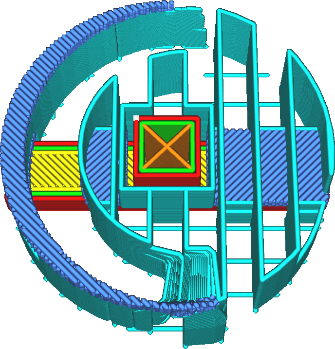

Směr linií střechy podpěry
====
Střecha podpěry je normálně orientována tak, aby byla co možná kolmá k modelu nad ní a k tělu podpěry pod ní. Pokud byla orientace spodních linií nebo linií podpěry přizpůsobeny, je také vhodné přizpůsobit orientaci linií střechy podpěry. Toto nastavení umožňuje přizpůsobit orientaci linií střechy podpěry.

Pro tento parametr lze vyplnit několik úhlů oddělených čárkami. Cura bude střídat tyto úhly mezi vrstvami.

Linie střechy podpěry by měly být v ideálním případě orientovány kolmo na linie podpěry, na nichž spočívají, a také na linie modelu, který na nich spočívá. Jejich orientací kolmo se zmenší vzdálenost, kterou musí tyto linie překlenout, což snižuje ochabování a zlepšuje kvalitu převisů. To je zvláště důležité při práci s podpěrou, která není úplně hustá.
