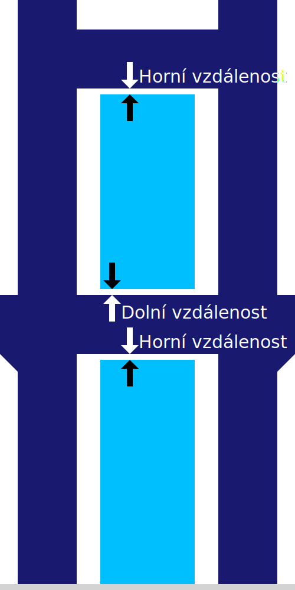

Vzdálenost podpěry nahoře
====
Toto nastavení umožňuje nakonfigurovat vzdálenost mezi horní částí podpěry a převislou plochou modelu.

Větší vzdálenost od podpěry je nejvlivnějším faktorem toho, jak podpěra přilne k modelu, kde model spočívá na podpěře. Zvětšení vzdálenosti usnadňuje vyjmutí podpěry po tisku, protože na tištěném objektu nebude dobře přilnutá. To však pouze zhorší vzhled převisu, protože může klesat ještě několik vrstev, než se opře o podpěru.