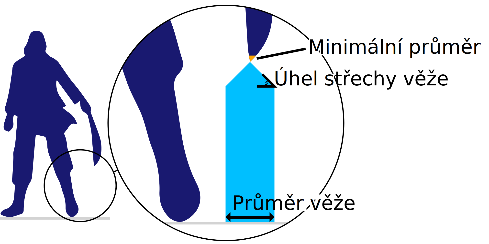

Maximální průměr nesený podpůrnou věží
====
Toto nastavení je práh pro průměr převisu, který umožňuje zvolit mezi normální podpěrou a podpůrnou věží. Pokud je část tenčí než tento práh, bude podpírána [podpůrnou věží](support_use_towers.md). Pokud je větší než tento práh, bude podpírána běžnými podpůrnými strukturami.

Pokud je třeba podepřít velmi tenký pruh převisu, normální podpěra se převrátí. Taková podpěra je příliš nevyzpytatelná, než aby mohla být správně vytisknuta. Místo toho se vytvoří pevnější věž.

Zvýšením tohoto parametru budou věže generovány častěji. To zvyšuje spolehlivost podpěry, ale také vyžaduje trochu více materiálu a času tisku.