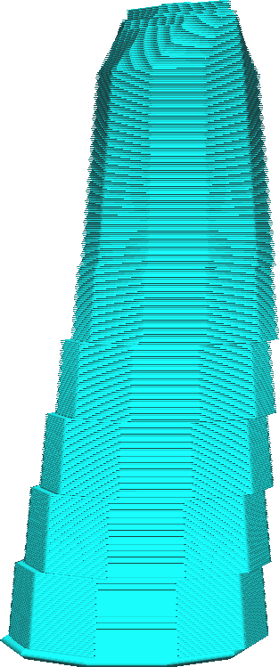

Průměr větví stromové podpěry
====
Tento parametr umožňuje upravit šířku větví stromové podpěry. Šířka specifikovaná zde bude šířka v horní části větví stromu. Konec větve bude tenčí a směrem dolů se bude postupně rozšiřovat podle parametru [Úhel průměru větví stromové podpěry](support_tree_branch_diameter_angle.md).

Širší větve jsou stabilnější, čímž se snižuje pravděpodobnost, že se strom shodí tryskou, pokud se po něm musí pohybovat.

Tím se ušetří nějaký materiál, ale také to může zabránit tomu, aby byl některý model správně podpírán, a dokonce i částí samotné podpěry. Když jsou větve sloučeny dohromady, již nemají obrys. Široké větve je lepší kombinovat buď [mezerami](support_tree_branch_distance.md) nebo nějakou [výplní](../support/support_infill_rate.md), aby se správně podepíraly části umístěné uprostřed širokých větví.

Pro širší větve bude také obtížnější orientovat se v modelu. To může způsobit, že více podpěry spočívá spíše na modelu než na podložce tisku. V důsledku toho může mít váš model po odstranění podpůrných struktur zjizvení.
