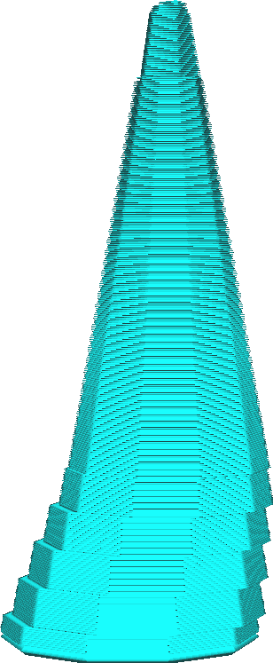

Úhel průměru větví stromové podpěry
====
Větve stromové podpěry jsou ve spodní části širší než nahoře. To zajišťuje, že větve zůstávají stabilní bez ohledu na výšku podpěry. Pomocí tohoto nastavení můžete řídit rychlost, se kterou se médium rozšiřuje.

Čím větší je úhel, tím větší je spodní část stromové podpěry, zejména u velkých modelů. To má několik efektů:
* Širší spodek ztěžuje převrácení podpěry. To zvyšuje spolehlivost stromové podpěry.
* Širší spodek vyžaduje pro tisk více materiálu a času.
* Úhel podpěry je připočítán k maximálnímu [úhlu](support_tree_angle.md), do kterého mohou větve přesahovat, takže velmi vysoké hodnoty mohou také v některých případech způsobit menší pevnost.
* Širší větve mají těžší orientaci v síti, což znesnadňuje přístup k částem přesahu z tiskové podložky. Podpěra proto může spočívat spíše na modelu než na podložce tisku, což zvyšuje množství jizev.
* Vyloučení kolizí stromů je obtížnější pro Curu vypočítat, což prodlužuje dobu slicování. Tento problém lze napravit zvýšením parametru [Rozlišení kolize stromové podpěry](support_tree_collision_resolution.md), ale také snižuje strukturální integritu stromové podpěry.

Obecně budete chtít, aby byl úhel takový, že podpěra stromu bude dostatečně široká, aby se sama mohla opřít v jakékoli výšce, aniž by se příliš uvolnila.