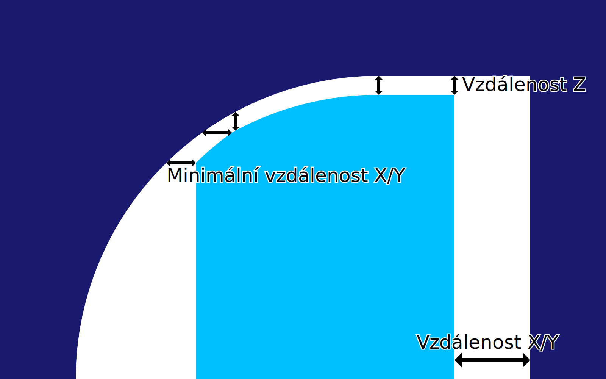

X/Y vzdálenost podpěry
====
Toto označuje vodorovnou vzdálenost, která má být respektována mezi podpěrou a modelem.

Cílem vodorovné vzdálenosti je zabránit tomu, aby podpěra zasáhla model, kde by na povrchu zanechala jizvu. Vytváří však také větší vzdálenost mezi modelem a nosnou strukturou, kde je umístěn převis, takže malé převisy nejsou podpírány.

Vzdálenost X/Y versus Z
----
Vzdálenost X/Y a vzdálenost Z musí být přesně dodrženy; nic víc, nic méně. To je příliš omezené, takže mezi nimi musí existovat preference. To je indikováno nastavením parametru [Priorita vzdálenosti podpěry](support_xy_overrides_z.md). Toto nastavení upravuje chování tohoto parametru  X/Y vzdálenosti podpěry.

Pokud má X/Y přednost před Z, vzdálenost X/Y je zachována, i když to znamená, že vzdálenost Z je příliš velká. Vzdálenost Z je vždy udržována na minimu.

Jestliže Z má přednost před X/Y, vzdálenost Z je zachována, i když to znamená, že vzdálenost X/Y je příliš krátká. Vzdálenost X/Y pak má vliv pouze mimo střechu podpěry, kde vzdálenost Z nemá žádný vliv.
