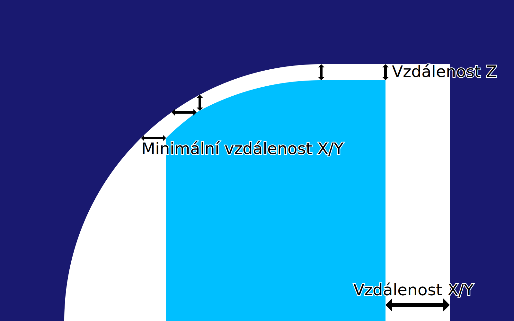

Minimální X/Y vzdálenost podpěry
====
Je-li vzdálenost Z od podpěry upřednostňována před vzdáleností X/Y, může být vodorovná vzdálenost mezi podpěrou a modelem menší než udává parametr [X/Y vzdálenost podpěry](support_xy_distance.md) aby se splnil požadavek parametru [Z vzdálenost podpěry](support_z_distance.md).

Tento parametr definuje minimální vzdálenost X/Y, která musí být respektována bez ohledu na vzdálenost Z. Tato minimální vzdálenost X/Y má opět přednost před vzdáleností Z.

Zvýšením tohoto nastavení se sníží riziko, že podpěra zasáhne model ze strany, a zanechá jizvu tam, kde to není potřeba. Také usnadňuje odstranění podpěry. Mějte však na paměti, že tato možnost je účinná pouze pro přesahy střední strmosti, kde by přesah měl být normálně podpírán, a proto se má na tomto místě dotýkat podpěry. Zvýšením tohoto nastavení převis dále klesá, čímž se snižuje jeho kvalita povrchu.