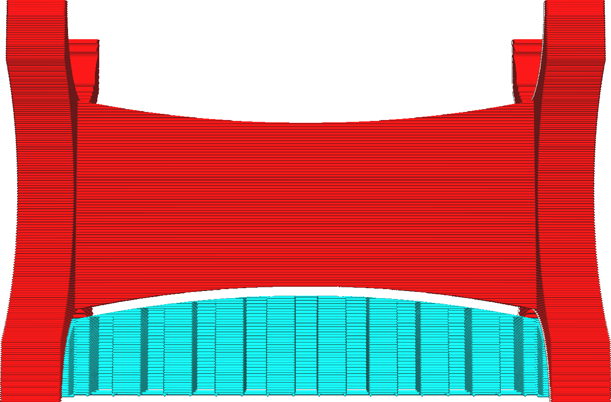

Vzdálenost Z od podpěry
====
Toto nastavení označuje svislou vzdálenost, která musí být udržována mezi podpěrou a modelem, a to jak nahoře, tak i dole.

Toto nastavení je nejvlivnějším faktorem, jak dobře se podpěra drží modelu.

Pokud je tento parametr snížen, bude podpěra držet model lépe. Převisy tak mají lepší vzhled, protože jim není dovoleno se tolik prohýbat. Tím se také zlepší stabilita podpěry, protože podlaha podpěry je pevně umístěna na modelu.

Pokud se toto nastavení zvýší, bude snazší podpěru vyjmout. To nezanechá tolik jizev na povrchu, kde podpěra podpírala model. Na druhé straně nebude model tak dobře podpírán. To snižuje kvalitu povrchu přesahů.

Obecně platí, že čím lépe podpůrný materiál přilne ke stavebnímu materiálu, tím důležitější by mělo být toto nastavení. Pokud k tisku podpěry použijete jiný materiál, vzdálenost Z může být výrazně snížena, protože dva různé materiály mají tendenci se po ztuhnutí snadněji oddělit. Pokud používáte materiál s dobrou přilnavostí vrstev, mělo by se nastavení trochu zvýšit. Tisk za horka nebo tlustší linie také zvyšují přilnavost, a proto také vyžaduje zvýšení tohoto nastavení.
