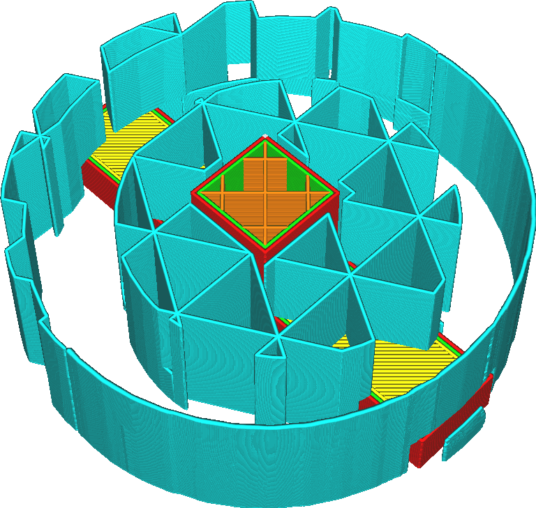

Propojit linie podpěry
====
U některých modelů podpěr může být podpěra velmi nestabilní, pokud jsou vyžadovány tenké proužky podpěr. Toto nastavení způsobí, že konce podpůrných linií se vzájemně spojí. To jim dává větší stabilitu. Umožňuje také tisknout podpěry s plynulejším tokem. Bude vyžadováno méně přesunů.

Když je nakreslena linie podpěry, namísto přechodu na další linii bude nakreslena linie podél hranice oblasti podpěry na další linii. Tím se celá oblast podpěry převede na jednu linii nebo na velmi málo linií. Převod na jednu linii není vždy možný. Počáteční bod této linie je libovolný, takže velmi často budou linie zavěšeny ve vzduchu, protože v jedné vrstvě mohou být dvě linie spojeny s koncovým bodem, zatímco v další vrstvě jsou propojeny na druhé straně. Díky tomu je podpěra o něco slabší, ale stále stabilní a pomáhá zabránit přerušení toku. Chování tohoto parametru je stejné jako chování parametru [Propojit linie výplně](../infill/zig_zaggify_infill.md).

Propojení linií podpěry má některé výhody, ale také některé nevýhody:
* Podpěra bude stabilnější a je méně pravděpodobné, že se během tisku převrátí.
* Tok bude udržován konstantní, což vám umožní tisknout podpěru vyšší rychlostí bez problémů s tokem. To je zvláště důležité pro substráty, které se obtížně správně vytlačují.
* Pokud dojde během podpěry k retrakcím, bude při tisku podpěry potřeba méně retrakcí, což zabrání broušení materiálu.
* K tisku podpěry je zapotřebí více materiálu.
* Tisk podpěry obvykle trvá déle, protože pohyby přesunů jsou obvykle rychlejší než tisk linií podpěry.

Vzor cik-cak podpěry je vždy připojen (pomocí trochu jiné techniky). Toto nastavení není k dispozici pro cikcak vzor.