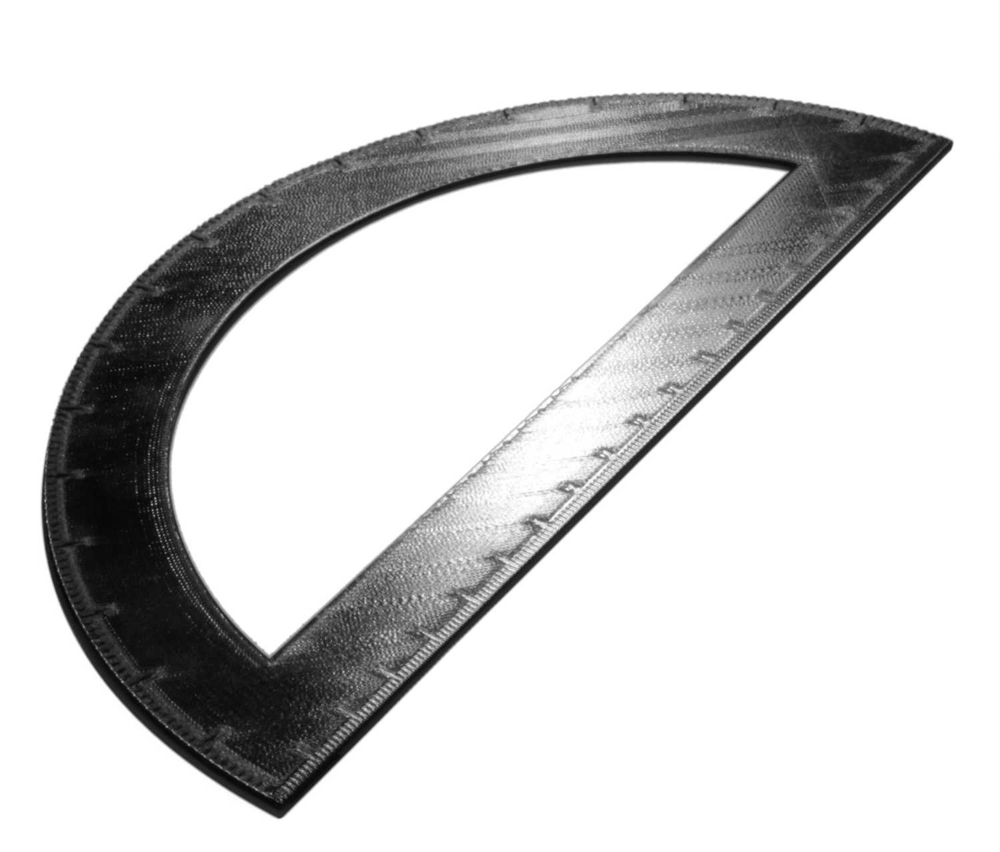

Monotónní horní/dolní pořadí
====
Cura obvykle řadí horní/dolní linie tak, aby vzdálenost mezi nimi byla malá. Pokud je toto nastavení povoleno, uspořádá horní/dolní linie tak, aby se sousední linie tiskly vždy s překrytím ve stejném směru.

Při tisku horních/dolních linií se linie obvykle trochu překrývají s liniemi vedle nich, protože tvar linie není dokonalý obdélník. Toto překrytí dává liniím mírný sklon, což způsobuje, že odrážejí světlo různými směry. Pokud se sousední linie různě překrývají, tento odraz se mění. To je vidět na konečném výsledku. Různé oblasti povrchu se díky tomu různě lesknou. Tisk v monotónním pořadí zajišťuje, že překrytí je na celém povrchu stejné, takže se neliší v tom, jak odráží světlo. Povrch tak vypadá konzistentněji a hladčeji.

Monotónní pořadí mírně prodlouží délku pojezdů, ale tento vliv je velmi minimální. Má pouze vizuální efekt na tisk. Monotónní řazení nemá žádné mechanické výhody.

Chcete-li dosáhnout hladkého povrchu, zvažte kombinaci tohoto nastavení s nastavením [režimu žehlení](../travel/retraction_combing.md), abyste se vyhnuli tvorbě koženého povrchu, a případně zapněte [Z-skoky](../travel/retraction_hop.md). Případně můžete také povolit [žehlení](ironing_enabled.md), ale to zcela přehluší užitečnost tohoto nastavení. Žehlení má vlastní volbu [monotoního nastavení](ironing_monotonic.md).

