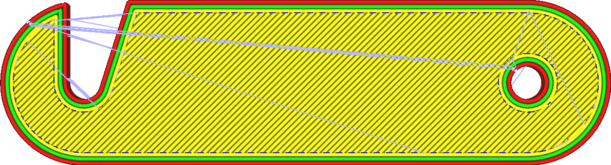
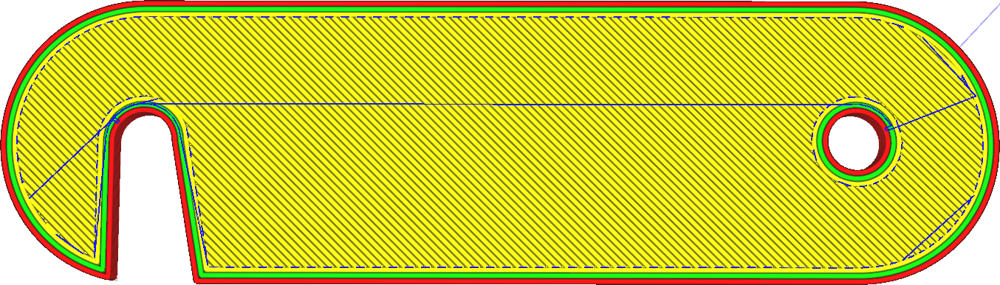

Režim objíždění
====
Objíždění je praxí vyhýbat se křížení stěn tisku při přesunu z jednoho místa na druhé. Křížení stěn má sklon zanechávat jizvu na povrchu, kde horká tryska opouští nebo vstoupila do objemu tisku, což je obecně nežádoucí.

Samotná objížďka způsobí, že se tryska vyhne stěnám, když prochází vnitřkem sítě. To však také umožňuje použít funkci [Při přesunu se vyhnout tištěným částem](travel_avoid_other_parts.md), která umožňuje trysce se vyhnout předmětům, když je mimo objem tisku.

Pokud je objektem od začátku do konce cesta, aniž by narazila na jakoukoli stěnu, bude tato cesta vedena bez retrakce. Pokud jsou počáteční a koncová místa na zcela samostatných cestách, tryska se nejprve přesune do polohy, kde jsou obě části nejblíže sobě, a nakonec se retrahuje (pokud je [retrakce povolena](retraction_enable.md)), přejde na cílovou cestu, případně se de-retrahuje a poté se přesune přes novou část do svého konečného cíle. V obou částech se zabrání nárazům na stěny při pohybu uvnitř. Při přesunu z jedné části na druhou se vyhne částem, pouze pokud je povoleno nastavení [Při přesunu se vyhnout tištěným částem](travel_avoid_other_parts.md).

Cílem režimu objížďky je zabránit průchodu stěnami předmětu a snížením množství jizev na povrchu. Rovněž sníží strunování viditelné z vnějšku, protože během přesunu bude materiál stále vytékat, ale tento tisk je umístěn uvnitř modelu. Režim objížďky však také prodlouží délku přesunu. Někdy musí provést velkou objížďku.

V rozbalovací nabídce tohoto nastavení jsou čtyři možnosti:
* **Zakázáno**: Režim objížďky je deaktivován. Pojezd bude vždy přímo do místa určení. Pokud se nedotkne žádné stěny, nebude retrahovat.
* **Vše**: Tryska se nedotýká žádné stěny, když se pohybuje uvnitř dutiny, jak je popsáno výše.
* **Ne v plášti**: Pokud je to možné, tryska se také vyhne dotyku s pláštěm. To může snížit zjizvení na horní straně tisku tím, že tryska bude běžet podél stěn, místo prořezávání se pláštěm. V některých případech však tryska nebude schopna uniknout a bude se muset retrahovat, jinak by došlo k poškození pláště.
* **Uvnitř výplně**: Nejpřísnější režim ze všech, který umožňuje objížďku pouze skrze výplň. Tím se zabrání označení vnitřních i vnějších stěn a také se vyhne označení pláště. Pokud se tryska dotkne vnitřních stěn, může to být někdy viditelné zvnějšku, protože její vnější poloměr může být širší než šířka stěny. Tím se tomuto efektu vyhnete. Bude však nutné provést ještě více retrakcí, protože často nebude k dispozici žádná cesta.