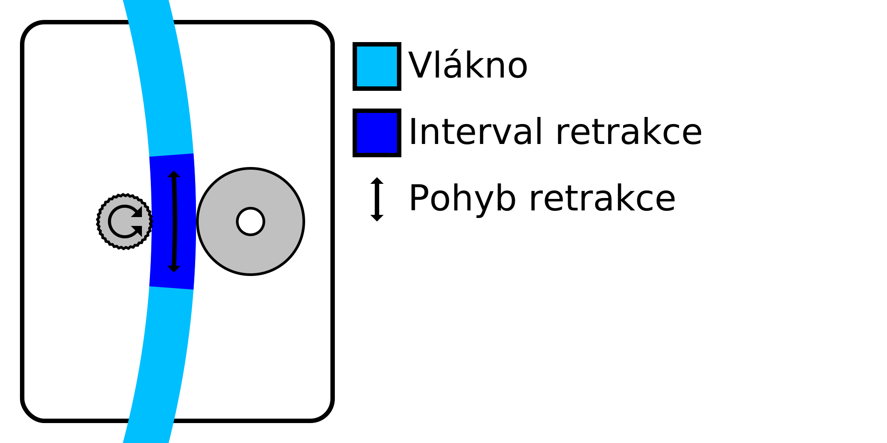

Interval minimální vzdálenosti extruze
====
Podávací kolo musí vlákno uchopit, aby se mohlo správně pohybovat. Retrakce materiálu má často sklon opotřebovat vlákno do té míry, že ho podávací kolo již nemůže správně uchopit. Toto nastavení omezuje počet retrakcí v určité délce vlákna, aby se zabránilo tomuto obrušování.

Retrakce jsou omezeny kombinací nastavení paremetru [Maximální počet retrakcí](retraction_count_max.md) a tímto nastavením. Materiál nemůže být retrahován více, než je hodnota maximálního počtu retrakcí na délku vlákna naznačené tímto nastavením intervalu minimální vzdálenosti retrakce.

Délka vlákna, během které je omezen počet retrakcí, je posuvné okno. Například s délkou okna 3 mm a maximálním počtem retrakcí 10 to znamená, že nová retrakce je povolena, jakmile je předchozí 10. retrakce provedena více než 3 mm zpět na vlákně.

Zvětšení délky okna retrakce účinně snižuje počet retrakcí. Díky tomu je tisk spolehlivější, ale zvyšuje se množství strun a kapek na povrchu. To je zvláště užitečné pro měkčí materiály, které jsou citlivější na obrušování.