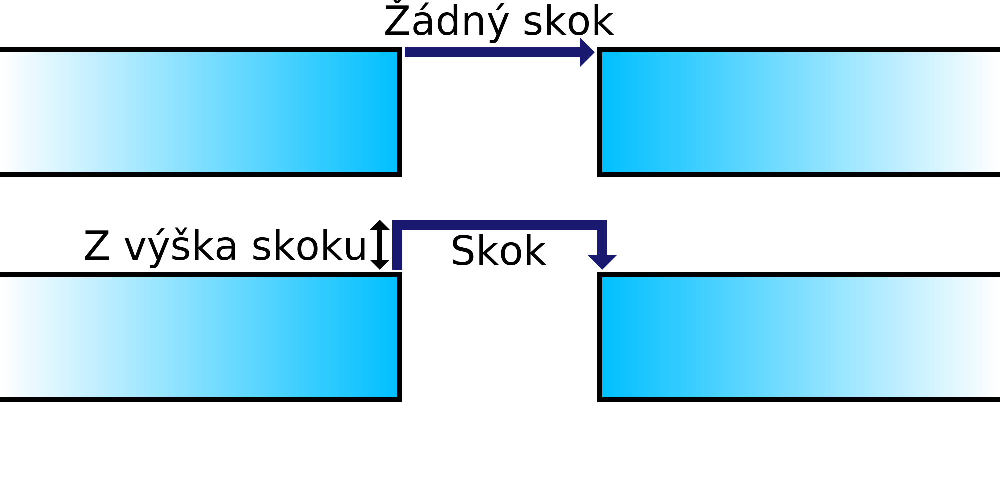

Výška Z-skoku
====
Je-li proveden Z-skok, toto nastavení určuje výšku, ve které se tryska bude pohybovat nahoru před dosažením svého cíle.

Vyšší Z-skok trvá déle, což zvyšuje celkovou dobu tisku a také mírně zvyšuje množství prosakování. Avšak příliš nízký přechod nad povrchem stejně umožňuje tryskající tryskou zasáhnout model, což jde proti cíli Z-skoku.