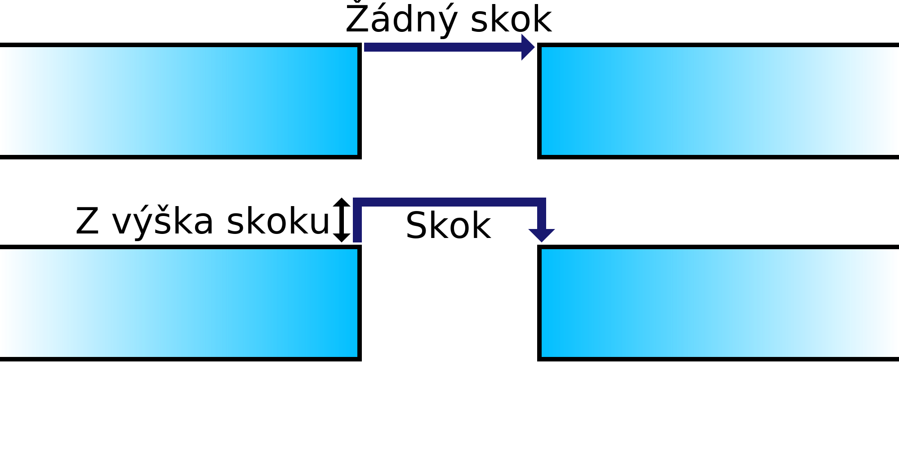

Z-skok při retrakci
====
Pokud je toto nastavení povoleno, tryska se zdvihne mírně nad tisk, když se potřebuje pohybovat z místa na místo. Cílem je, aby tryska procházela nad tiskem namísto zasažení dříve vytištěných částí.

Při každé retrakci se tryska zvedne (nebo se sníží podložka tisku), aby se vytvořil prostor mezi tryskou a tiskem. To má několik výhod:
* Zabraňuje tomu, aby tryska při pohybu narazila na tisk. Když tryska zasáhne tisk, zanechá viditelnou jizvu, takže toto by mělo zlepšit vizuální kvalitu tištěných stěn.
* Pokud materiál během pohybu vytéká z trysky, usadí se tam, kde tryska usedá po přemístění, často ve výplni, kde není vidět. To pomáhá redukovat kapky na povrchu.
* Kapky na povrchu mají šanci způsobit pokles celkového dojmu tisku, takže aktivace tohoto nastavení může zvýšit spolehlivost.

Pohyb trysky nahoru a dolů však trvá trochu déle, takže tisk bude trvat déle. Osa Z tiskárny se také může rychleji opotřebovat, v závislosti na konstrukci tiskárny.
