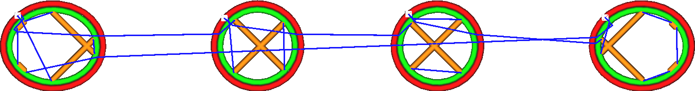

Při přesunu se vyhnout tištěným částem
====
Aktivací tohoto parametru se tisková hlava pokusí zabránit nárazům do jiných objektů, když se pohybuje v objemu tisku. Spíše udělá malou odbočku. Je-li objížďka možná a nedotýká se žádného jiného objektu, nespouští se žádné retrakce, pokud délka cesty nepřesáhne parametr [Maximální vzdálenost objížďky bez retrakce](retraction_combing_max_distance.md).

Kromě vyhýbání se dalším částem se přesuny také pokusí zůstat co možná nejblíže stěn. To znamená, že když opouští nebo vstupuje do dílu stěnou, opustí ho nebo do něj vstoupí kolmo ke stěně.

Toto nastavení má tendenci zlepšovat kvalitu tiskového povrchu, protože tryska nebude procházet stěnami tak často. Při průchodu stěnou zanechává na stěně jizvu, tomu je třeba se vyhnout.

Toto nastavení však zvyšuje prosakování, protože bude existovat více přesunů bez retrakcí a cesty budou delší. U materiálů, které hodně vytékají, může být vhodné deaktivovat vyhýbáním se jiným součástem.

Doba tisku může být mírně prodloužena, protože přesuny jsou delší, ale obecně je to kompenzováno snížením počtu retrakcí, které s tím souvisí.