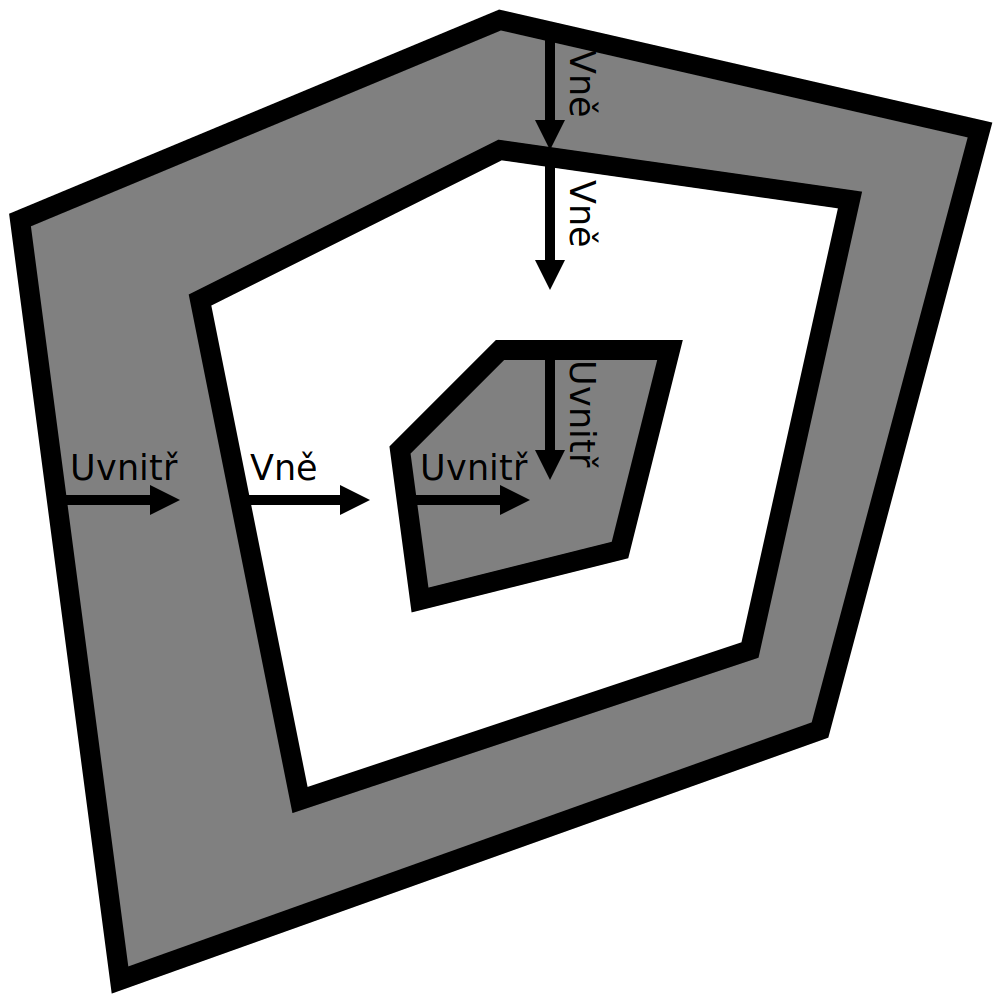
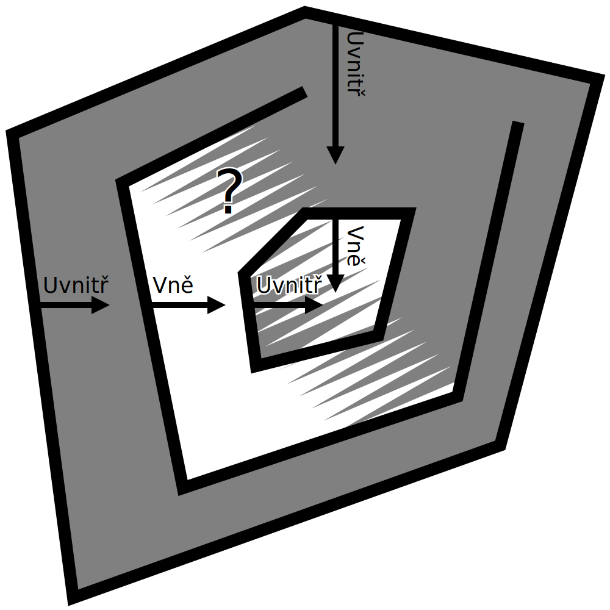

Chybějící části
===

Někdy při kontrole pohledu na vrstvu (nebo pokud máte při tisku smůlu) se zdá, že některé části tisku chybí. To může mít několik důvodů. Tento článek uvádí některé možnosti.

Non-manifold sítě
----
Některé sítě mají na svém povrchu otvory nebo další geometrii. To Curu mate, protože už není jasné, které části objemu patří dovnitř a které ne. Při pohledu na průřez modelu bude Cura počítat zvenčí. První povrch, který protíná, znamená, že jde do vnitřku modelu. Druhá plocha znamená, že jde opět ven. Třetí povrch, který protíná, znamená, že se vrací zpět dovnitř atd. Pokud některé části povrchů chybí nebo jsou uprostřed dodatečné volné povrchy, stává se vnitřek nejednoznačným podle toho, ze které strany se díváte.

Sítě, které mají takové chybějící povrchy nebo další části, se nazývají non-manifold, protože by nemohly ve skutečném světě existovat. Cura se je pokusí opravit uzavřením malých mezer, ale pokud povrch nelze opravit, zůstane netisknutelný (pokud není nastaven [Povrchový režim](../blackmagic/magic_mesh_surface_mode.md) pro jejich zahrnutí) . Chybějící nebo další geometrie se také zobrazí na 3D scéně se skvrnitým vzorem nebo červeně ve fázi Příprava, při použití rentgenového pohledu. Tím se povrch zbarví jinak, pokud patří k lichému počtu povrchů, což se stane pouze v případě, že síť není manifold. To pomáhá identifikovat problémy se sítí. Tyto sítě pak budete muset opravit v CAD nebo modelovací aplikaci.

Přestože Cura obvykle předpokládá, že je síť manifold, v některých případech může model opravit. Zde je několik příkladů toho, co můžete vyzkoušet:
* [Extenzivní sešití](../meshfix/meshfix_extensive_stitching.md) lépe zvládne případy, kdy je k vnější straně modelu připojena další geometrie, i když slicování trvá o něco déle.
* [Ponechat otevřené povrchy](../meshfix/meshfix_keep_open_polygons.md) uzavře všechny otevřené smyčky přímkou. Tím se uzavírají malé mezery. Může však také způsobit, že model bude vypadat velmi zvláštně, pokud má velké mezery.
* Jako poslední možnost lze použít [Povrchový režim](../blackmagic/magic_mesh_surface_mode.md) k tisku perforovaných částí jako jedné stěny bez jakéhokoli obsahu. Protože není známo, kde se nachází vnitřek této části, nedochází k žádné výplni nebo plášti, ale alespoň obrys lze nakreslit. V některých případech to může vyvolat dojem, že tisk je stále průchodný.

Pokud tyto možnosti neposkytují požadovaný výtisk, budete ho muset opravit manuálně, pomocí aplikací pro 3D modelování.

Tenké části
----
Pokud má model má velmi jemné detaily, ne všechno lze nakreslit tlustými liniemi vycházejícími z vaší 3D tiskárny. Cura upraví linie uvnitř tvaru definovaného vaší sítí. Pokud to není možné, nic se nevytiskne. V takovém případě se může zdát, že některé části tisku chybí.

Tento problém lze vyřešit několika způsoby:
* Snižte [šířku linií](../resolution/line_width.md). Pokud tisknete něco, co má tenké stěny nebo pásky, ujistěte se, že šířka linie je o něco menší než minimální šířka této části. Nadměrné snížení šířky linií však může vést k [pod-extruzi](underextrusion.md) v důsledku nedostatečného toku. Abyste mohli dále zmenšovat šířku linie, budete muset použít menší trysku.
* K tisku přidejte trochu [horizontálního rozšíření](../shell/xy_offset.md). Díky tomu je celý model širší na všech stranách, včetně tenkých linií. Tímto způsobem jsou tenčí, takže je lze nyní tisknout. Samozřejmě to také zničí rozměrovou přesnost a detaily tisku, protože vše zesílí.
* Aktivujte parametr [Tisk tenkých stěn](../shell/fill_outline_gaps.md). Ten se pokusí vyplnit tenké části velmi malými liniemi, aniž by se zmenšily šířky linií zbytku modelu. To však způsobuje velké změny v toku materiálu a nemusí vždy vyplňovat stěny pěknými pravidelnými liniemi.
* Nezapomeňte přizpůsobit model tisku tak, aby byl každý kus nejméně tak silný jako je šířka linie.
