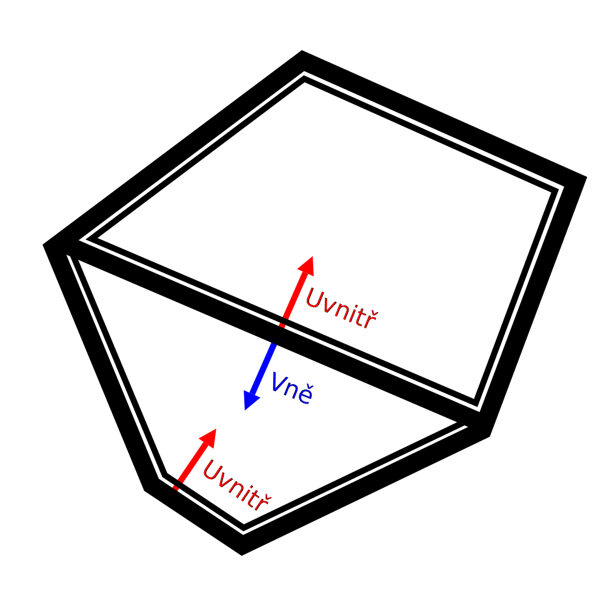

Chybějící části
===

Někdy při kontrole pohledu na vrstvu (nebo pokud máte při tisku smůlu) se zdá, že některé části tisku chybí. To může mít několik důvodů. Tento článek uvádí některé možnosti.

Nerozdělená síť
----
Některé sítě mají na povrchu otvory nebo další geometrii. Díky tomu je Cura zmatená, protože již není jasné, které části objemu patří do interiéru a které nikoli. Cura vezme průřez sítě v každé vrstvě a předpokládá, že najde uzavřené smyčky. Pokud neexistují žádné uzavřené smyčky nebo jsou-li vedle těchto uzavřených smyček další povrchy, obvykle se netisknou. Proto, pokud je v modelu otvor, nebudou průřezy uzavřené smyčky a vrstvy, kde tato díra existuje, vytištěny. Sítě, které obsahují takové otvory nebo dodatečnou geometrii, se nazývají [variety](https://en.wikipedia.org/wiki/Manifold), protože by nemohly v reálném světě existovat.

Pokud síť není varietní, můžete ji obecně vidět vstupem do přípravné fáze a výběrem rentgenového pohledu. Rentgenový pohled bude vybarvovat určité části červeně, pokud se podíváte na lichý počet povrchů, ke kterému dochází, když síť není varietní. Tímto způsobem můžete identifikovat problémy se sítí. Tyto sítě pak budete muset opravit v CAD nebo modelovací aplikaci.

Přestože Cura obvykle předpokládá, že je síť varietní, v některých případech může model opravit. Zde je několik příkladů toho, co můžete vyzkoušet:
* [Extenzivní sešití](../meshfix/meshfix_extensive_stitching.md) lépe zvládne případy, kdy je k vnější straně modelu připojena další geometrie, i když řezání trvá o něco déle.
* [Ponechat otevřené povrchy](../meshfix/meshfix_keep_open_polygons.md) uzavře všechny otevřené smyčky přímkou. Tím se uzavírají malé mezery. Může však také způsobit, že model bude vypadat velmi zvláštně, pokud má velké mezery.
* Jako poslední možnost lze použít [Povrchový režim](../blackmagic/magic_mesh_surface_mode.md) k tisku perforovaných částí jako jedné stěny bez jakéhokoli obsahu. Protože není známo, kde se nachází vnitřek této části, nedochází k žádné výplni nebo plášti, ale alespoň obrys lze nakreslit. V některých případech to může vyvolat dojem, že tisk je stále průchodný.

Pokud tyto možnosti neposkytují požadovaný výtisk, budete ho muset opravit manuálně pomocí aplikací 3D modelování.

Tenké části
----
Pokud má model má velmi jemné detaily, ne všechno lze nakreslit tlustými liniemi vycházejícími z vaší 3D tiskárny. Cura upraví linie uvnitř tvaru definovaného vaší sítí. Pokud to není možné, nic se nevytiskne. V takovém případě se může zdát, že některé části tisku chybí.

Tento problém lze vyřešit několika způsoby:
* Snižte [šířku linií](../resolution/line_width.md). Pokud tisknete něco, co má tenké stěny nebo pásky, ujistěte se, že šířka linie je o něco menší než minimální šířka této části. Nadměrné snížení šířky linií však může vést k [pod-extruzi](underextrusion.md) v důsledku nedostatečného toku. Abyste mohli dále zmenšovat šířku linie, budete muset použít menší trysku.
* K tisku přidejte trochu [horizontálního rozšíření](../shell/xy_offset.md). Díky tomu je celý model širší na všech stranách, včetně tenkých linií. Tímto způsobem jsou tenčí, takže je lze nyní tisknout. Samozřejmě to také zničí rozměrovou přesnost a detaily tisku, protože vše zesílí.
* Aktivujte parametr [Tisk tenkých stěn](../shell/fill_outline_gaps.md). Ten se pokusí vyplnit tenké části velmi malými liniemi, aniž by se zmenšily šířky linií zbytku modelu. To však způsobuje velké změny v toku materiálu a nemusí vždy vyplňovat stěny pěknými pravidelnými liniemi.
* Nezapomeňte přizpůsobit model tisku tak, aby byl každý kus nejméně tak silný jako je šířka linie.