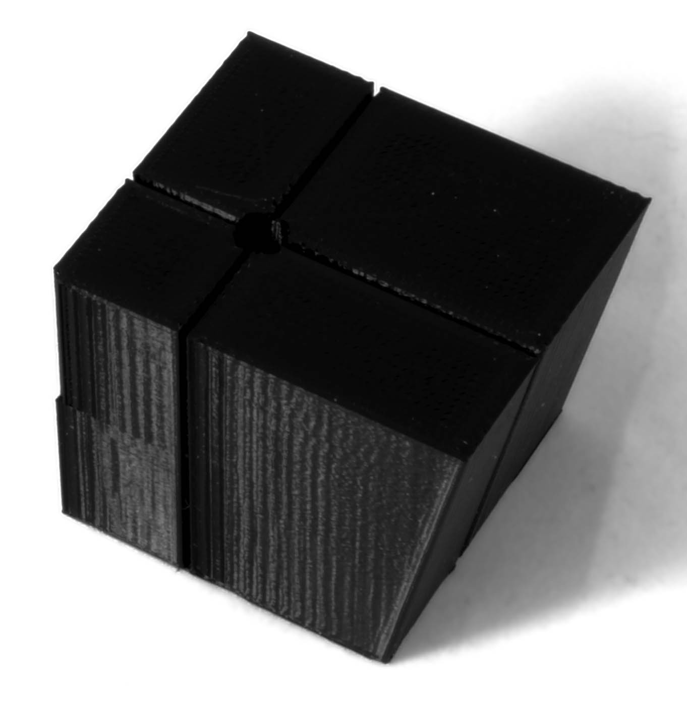

Vlnky
====
Vlnky (někdy nazývané „duchové“) je efekt, kdy se vlnky objevují na jinak plochých površích poblíž malých detailů na tomto povrchu. Zvlnění se začne objevovat ihned po tisku malých detailů.

Příčiny
----
Vlny jsou způsobeny vibracemi vaší 3D tiskárny. Snažit se vyhnout zvlnění znamená omezit tyto vibrace. Jsou obzvláště výrazné, pokud se tisková hlava pohybuje v jedné z rezonančních frekvencí rámu vaší tiskárny.

Toto je jedna z věcí, které se dražší 3D tiskárny obvykle pokoušejí vyhnout pomocí tužšího rámu, který méně vibruje. Mají silnější portál s tvrzenými ocelovými tyčemi a pruty nebo poskytují plně uzavřený rám vyrobený z velmi tuhého materiálu. To je ale drahé, takže levné modely 3D tiskáren nemají zdroje, které by zabránily vybracím. Tiskárny vybavené bowdenovou trubicí také nemají tolik vlnek, protože tisková hlava je mnohem lehčí než tisková hlava s přímým pohonem (protože motor s velkým posuvem spočívá na tisková hlava).

Ačkoli vlnky se projevují vodorovně, vibrace nejsou vždy vodorovné. Vibrace tiskové plochy nahoru a dolů ve vztahu k trysce je také velmi důležitým efektem, protože kapka plastu je rozdrcena a rozšíří se, když tisková plocha vibruje blíže nebo se zeslabí, když vibruje dále.

Hardwarová řešení
----
Před úpravou tisku v aplikaci Cura je dobré nejprve zjistit, zda můžete vylepšit své vybavení, abyste se vyhnuli zvlnění. To může pomoci zlepšit celkové výsledky tisku, aniž by došlo k obětování jiných kvalit tisku, jako je síla nebo produktivita. Zde je několik věcí, které je třeba zvážit:
* Přidejte pod tiskárnu tlumiče. Můžete použít gumové nožičky nebo jednoduše umístit tiskárnu na blok měkké pěny. To zabrání vibracím, pokud stůl vibruje, a také zabrání vibracím stolu. Tím se sníží zpětná vazba, kterou vibrační tiskárna dostává od stolu, což pomáhá snížit vysokofrekvenční vibrace.
* Utáhněte hnací řemeny. Pokud tyto pásy nejsou napnuté, pružnost jejich gumy umožňuje vibraci tiskové hlavy.
* Pokud je vaše tisková hlava vybavena pružnými spojovacími prvky, jako je bowdenová trubice, nezapomeňte je upevnit tak, aby již nemohly kmitat. Pro bowdenové trubičky dobře fungují stahovací pásky, pokud je můžete k něčemu připevnit.
* Přidejte do rámu vaší 3D tiskárny více hmoty. To ztěžuje pohyb rámu kvůli jeho zvýšené setrvačnosti, a proto bude obtížněji vibrovat.
* Zvyšte tuhost rámu vaší 3D tiskárny pomocí dalších výztuží nebo příček. Mohli byste je vyrobit z odolných materiálů, jako je ocel, ale pokud to není možné, můžete najít v železářství produkt, který se hodí s minimálními úpravami. Můžete také zvážit tisk těchto výztuží a křížů ve 3D, ale uvědomte si, že většina plastů si s aplikovanou trvalou silou neporadí.

Cura řešení
----
Pokud hardwarová řešení nejsou možná, můžete také omezit efekt zvlnění některými úpravami nastavení Cury.

Protože vibrace jsou způsobeny zrychlením tiskové hlavy, jsou nejdůležitější vylepšení zaměřena na snížení těchto zrychlení.
* Snížení maximální [rychlosti tisku](../speed/speed_print.md) zkracuje dobu zrychlení.
* Snížení hodnoty [zrychlení](../speed/acceleration_print.md) přímo snižuje zrychlení a sniží sílu vibrací.
* Ve 3D tisku je [ryv (jerk)](../speed/jerk_print.md) průmyslový pojem, který označuje okamžité změny rychlosti v rozích. To znamená, že se v podstatě snaží nekonečně zrychlovat, aby v každém rohu nemusel příliš zpomalit. To způsobuje velmi vysoké zrychlení na krátkou dobu v každém rohu. Snížení ryvu (jerku) pak může také pomoci snížit vibrace. Místo krátkého a silného zrychlení zrychluje pomaleji a déle, což snižuje vysokofrekvenční vibrace, ale zvyšuje nízkofrekvenční vibrace.

Díky těmto úpravám bude tisk trvat déle. Můžete se však také vyhnout vlnění jinými způsoby tím, že zamezíte typům pohybů, které to způsobují.
* Zakažte techniku ​​[vyplňování mezer](../shell/fill_perimeter_gaps.md) a ne [tisk tenkých stěn](../shell/fill_outline_gaps.md), protože tyto techniky někdy používají velmi malé segmenty linií a další přesuny. Pokud je stěna vytištěna později, tiskárna trochu vibruje.
* Pokud vaše tiskárna přesunuje tiskovou podložku spíše nahoru a dolů a ne tiskovou hlavu, nepoužívejte [Z-skoky](../travel/retraction_hop_enabled.md). To způsobí vibraci tiskové plochy nahoru a dolů dlouho po provedení skoku.

Můžete také vytisknout [vnitřní stěny před vnější stěnou](../shell/outer_inset_first.md). Protože tisk stěn obecně nezpůsobuje tolik vibrací jako ostatní části, umožňuje to tiskárně zastavit vibrace před tím, než je vytištěna vnější stěna, která je tak důležitá.

Nakonec, v závislosti na geometrii vašeho rámu, jsou vibrace někdy absorbovány různě v různých směrech. Pomůže také otáčení vašeho tisku o 45 stupňů.