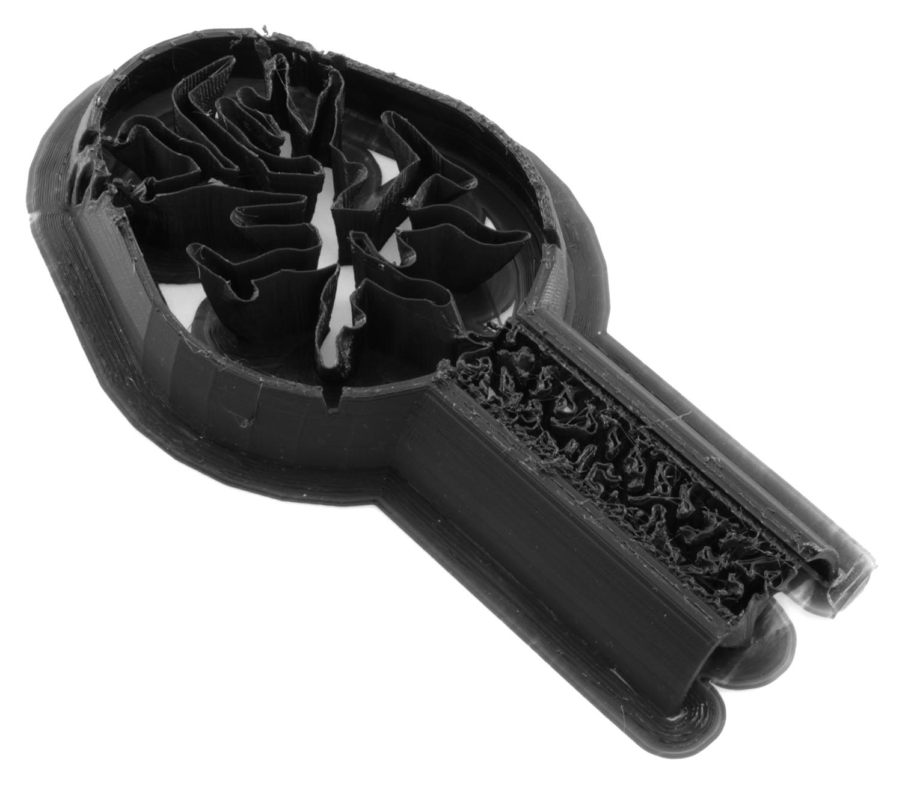

Nedokončený tisk
====
Někdy se tisk nekončí úplně. Existuje několik důvodů pro tento jev, z nichž některé lze vyřešit úpravou nastavení parametrů aplikace Cura.

Poruchy tiskárny
----
Příčinou neúplného tisku je někdy selhání tiskárny, když tiskárna nedělá to, co se od ní očekává. Obecně platí, že Cura může udělat jen málo pro nápravu těchto problémů. Zde jsou některé běžné příčiny.
* Výpadek napájení. Cura s tím nemůže dělat nic jiného než rychlejší tisk, aby se snížilo riziko výpadku napájení během tisku.
* Porucha napájení. Pokud je jedna z teplot (buď [podložky tisku](../material/material_bed_temperature.md) nebo [trysky](../material/material_print_temperature.md)), příliš vysoká, některé tiskárny mají poruchový režim, kde napájecí zdroj shoří nebo teplotní senzory vydávají chyby. Tiskárna se poté vypne a nedokončí tisk.
* Firmware zamrzne. V důsledku chyb ve firmwaru může tiskárna přestat reagovat. Pokud můžete určit, kde v g-kódu zamrzne (nejčastěji na začátku nebo na konci tisku), můžete zjistit, který g-kód to způsobuje. Může být nutné upravit počáteční nebo koncový g-kód.
* Cívka je zamotaná. Je dobré vždy uchytit konec vlákna, pokud není bezpečně upevněno v extrudéru nebo pokud není zasunut do jednoho z otvorů ve vláknu (pokud vaše cívka takové otvory má). Pokud ho pustíte,  konec vlákna skočí zpět na cívku, může sklouznout pod jedno z dalších závitů a zamotat se. Jelikož je vlákno obvykle stovky metrů dlouhé, může být velmi obtížné tento uzel uvolnit, pokud se dostane dovnitř.

Broušení vláken
----
Podavač někdy tlačí velmi tvrdě na vlákno, aby ho protlačil přes extrudér. To poškodí vlákno. Když podavač velmi často tlačí a táhne za stejný konec vlákna, může ho to poškodit natolik, že se podávač již nemůže na vláknu nijak zachytit. Materiál potom přestane proudit a zbytek tisku se tiskne spíše na vzduch než na plast.

Můžete to cítit během tisku umístěním prstu do otvoru, kde vlákno prochází do podavače. Během tisku byste měli cítit, jak se vlákno pohybuje. Pokud se nepohybuje, je to pravděpodobně proto, že se materiál rozdrtil a že se na něm nedrží. Můžete také vytáhnout vlákno z tiskárny a zjistit, kde je poškozené.

Chcete-li tomuto problému zabránit, můžete provést následující úpravy nastavení v aplikaci Cura:
* Snižte [Maximální počet retrakcí](../travel/retraction_count_max.md) nebo zvětšete [Interval minimální vzdálenosti extruze](../travel/retraction_extrusion_window.md). Tím se omezí počet retrakcí provedených během vytlačování dané délky vlákna. Ve skutečnosti to omezuje frekvenci, se kterou se podavač může pohybovat tam a zpět na každém kusu vlákna.
* Snižte [Vzdálenost retrakce](../travel/retraction_amount.md). To opět omezí, kolikrát se podavač bude pohybovat tam a zpět na stejném kusu vlákna.
* Snižte [Rychlost retrakce](../travel/retraction_speed.md). Pokud se materiál pohybuje rychle, ale v každém bodě cesty je blokován, podavač materiál rozmělní. Pokud se materiál pohybuje pomaleji, je menší šance, že se to stane.
* Tiskněte pomaleji snížením [výšky vrstvy](../resolution/layer_height.md), [šířky linie](../resolution/line_width.md) nebo [rychlosti tisku](../speed/speed_print.md). Tím se snižuje síla, kterou musí podavač vyvíjet na vlákno, což snižuje riziko jeho rozdrcení.
