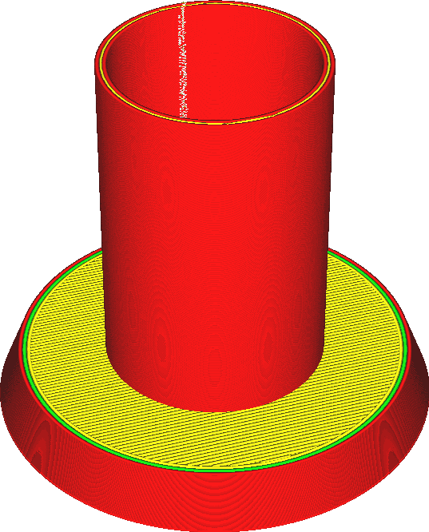
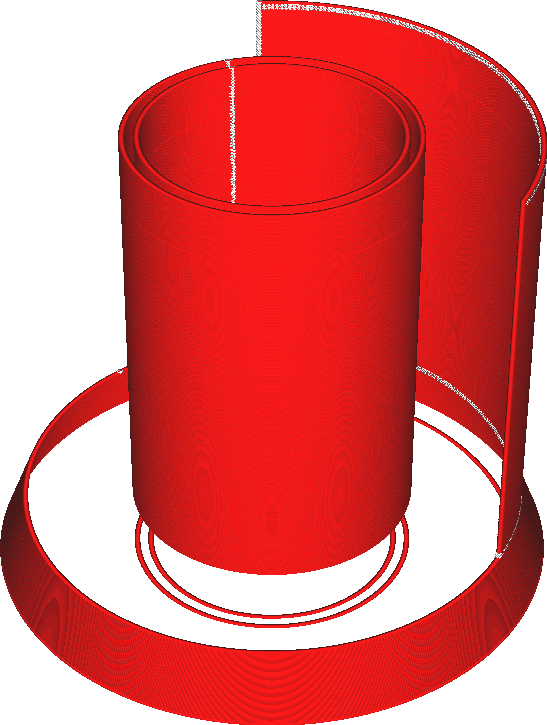
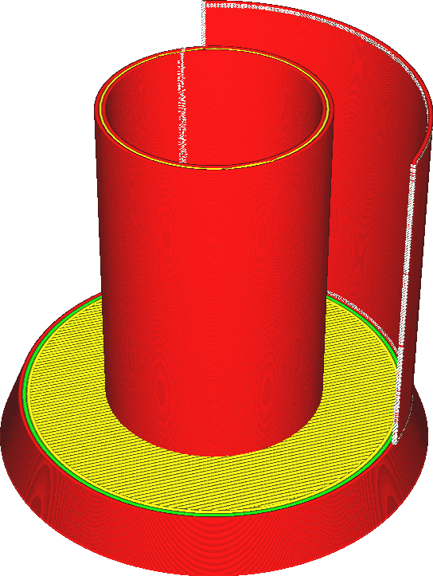

Oberflächenmodus
====
Normalerweise erstellt Cura Querschnitte von allen Dreiecken in Ihrem Netz. Diese Liniensegmente werden zu Schleifen zusammengefügt. Alle Schleifen, die nicht geschlossen sind, werden verworfen.

Diese Einstellung steuert, was mit diesen nicht geschlossenen Schleifen geschehen soll. Ist die Einstellung "Normal", werden sie verworfen. Bei der Einstellung "Oberfläche" werden alle Querschnitte als Umrisse gedruckt. Bei der Einstellung "Beides" werden die geschlossenen Umrisse normal gedruckt, aber die nicht geschlossenen werden separat als zusätzliche Wände gedruckt.

<!--screenshot {
"image_path": "magic_mesh_surface_mode_normal.png",
"models": [{"script": "extra_surface.py"}],
"camera_position": [66, 129, 124],
"settings": {
    "magic_mesh_surface_mode": "normal"
},
"colours": 32
}-->
<!--screenshot {
"image_path": "magic_mesh_surface_mode_surface.png",
"models": [{"script": "extra_surface.py"}],
"camera_position": [66, 129, 124],
"settings": {
    "magic_mesh_surface_mode": "surface"
},
"colours": 32
}-->
<!--screenshot {
"image_path": "magic_mesh_surface_mode_both.png",
"models": [{"script": "extra_surface.py"}],
"camera_position": [66, 129, 124],
"settings": {
    "magic_mesh_surface_mode": "both"
},
"colours": 32
}-->

Die zusätzlichen Flächen, die gedruckt werden, umfassen nur die vertikalen Flächen als einzelne Linien. Für horizontale Flächen gibt es keine Fülltechnik, da die Flächen keine geschlossenen Polygone sind. Sie können nicht gefüllt werden, da es kein Innenleben gibt. Es kann keine Oberseiten, Unterseiten, Füllungen oder Stützen geben. Nur einzelne Linien.

Die zusätzlichen Flächen werden so gedruckt, als wären sie Außenwände, so dass sie von der Druckgeschwindigkeit für Außenwände, der Linienbreite usw. beeinflusst werden. Außerdem werden diese Flächen mit einer Linie gedruckt, die genau auf der Fläche zentriert ist, anstatt die Linie an der Innenseite des Modells auszurichten. Das bedeutet, dass die Linie mit einer halben Linienbreite auf jeder Seite der Oberfläche verläuft. Dies geschieht, weil es nicht eindeutig ist, welche Seite der Oberfläche die Innenseite des Modells ist. Ihr Druck wird nicht maßhaltig sein. Wenn, wie im obigen Screenshot, die zusätzliche Fläche an einer normalen, massiven Fläche ausgerichtet ist und Sie die Option "Beide" verwenden, um fehlende Wände zu ergänzen, werden die Ebenen nicht richtig ausgerichtet.

**Wenn Sie sowohl die normalen Volumen als auch die zusätzlichen Flächen drucken, denken Sie daran, dass die Volumen so gedruckt werden, dass die äußere Wand vollständig innerhalb des Volumens liegt. Die zusätzlichen Flächen werden so gedruckt, dass die Linie mittig auf der Fläche liegt und die Hälfte der Breite der Linie auf jeder Seite liegt. Wenn eine zusätzliche Fläche an der Oberfläche eines geschlossenen Volumens ausgerichtet wird, wie in den obigen Abbildungen, wird die Fläche um eine halbe Linienbreite verschoben. Schließlich hat die zusätzliche Fläche kein Inneres, auf das sie sich zubewegen könnte.**