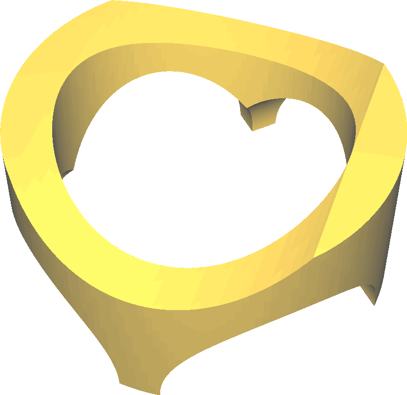
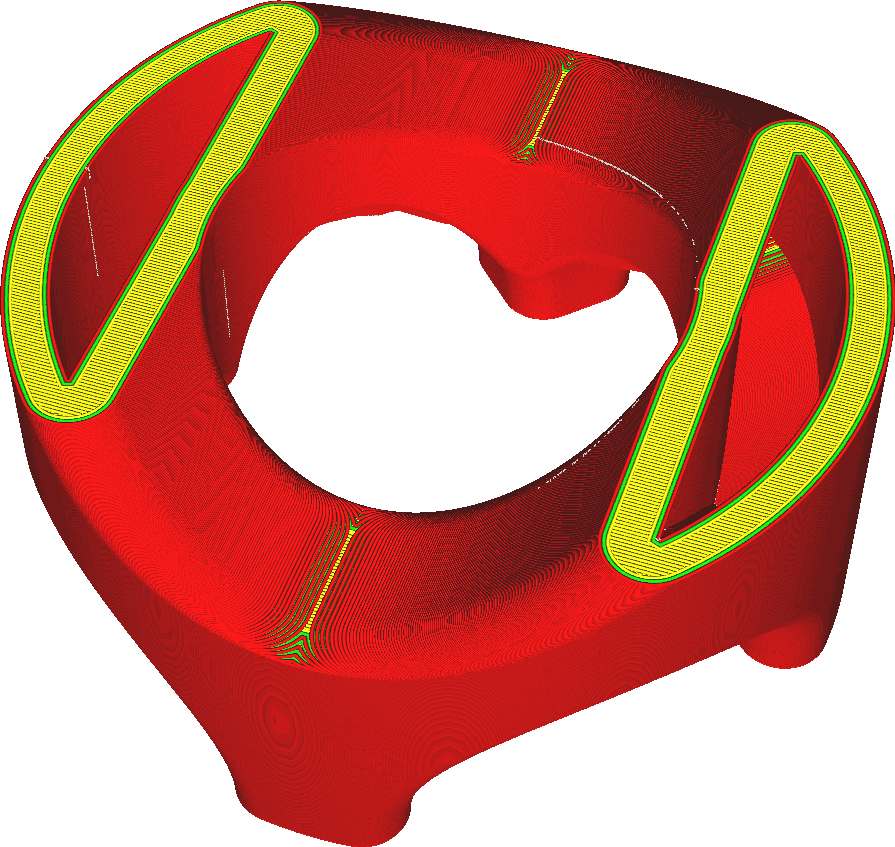

Form
====
Anstatt das Modell selbst zu drucken, erzeugt der Drucker mit dieser Funktion ein Negativ des Modells, eine Form, in die Sie ein anderes Material gießen können, um Ihr Modell zu erstellen. Diese Form hat mehrere spezifische Eigenschaften, die sie sowohl für das Gießen als auch für das Drucken mit dem FFF-Drucker geeignet machen. Dies ermöglicht den Prozess des [Rapid Casting](https://en.wikipedia.org/wiki/Rapid_casting).

<!--screenshot {
"image_path": "mold_enabled_shell.png",
"models": [{"script": "stature.scad"}],
"camera_position": [-78, 160, 228],
"layer": -1
}-->
<!--screenshot {
"image_path": "mold_enabled_mould.png",
"models": [{"script": "stature.scad"}],
"camera_position": [-78, 160, 228],
"settings": {
    "mold_enabled": "True"
},
"colours": 32
}-->

Curas Formgenerierung erzeugt einen Hohlkörper mit der genauen Form, die Sie gießen möchten. Um diesen Hohlraum wird eine Schalung mit einer bestimmten Breite erzeugt, die über die Einstellung [Mindestbreite der Form](mold_width.md) konfigurierbar ist. Oberhalb und unterhalb der Form wird eine Schicht mit einer bestimmten Höhe erzeugt, die über die Einstellung [Dachhöhe der Form](mold_roof_height.md) eingestellt werden kann. Damit Sie das Gussmaterial einfüllen können wird diese Schicht nicht an der Oberseite des Modells erzeugt. Sie wird auch nicht an der Unterseite des Modells erzeugt. Sie soll auf der Druckplatte bleiben, während das Modell gegossen wird.

Entwerfen Sie Ihre Gussform
----
Die Formerstellung in Cura ist nicht perfekt. Es fehlen ein paar Dinge. Hier sind einige Tipps, um sie zu beheben.
* Cura erstellt keine Gusskanäle für alle lokalen Spitzen in Ihrem Modell. Sie müssen Ihrem Modell vertikale Abzweigungen hinzufügen, wo immer Sie einen Gusskanal benötigen.
* Cura unterstützt nicht das Gießen von zusätzlichem Material für den Fall, dass Ihr Material beim Abkühlen schrumpft. Wenn Sie ein Material verwenden, das stark schrumpft, müssen Sie selbst an der höchsten Stelle Ihres Modells zusätzliche Gusskanäle hinzufügen.
* Die Form von Cura besteht immer aus einem Stück. Für viele Formen bedeutet dies, dass die Form zerstört werden muss, um sie zu entfernen. Formen können auf verschiedene Arten zerstört werden: durch schiere Kraft oder durch Erhitzen, wenn das Material im Inneren dies zulässt, oder durch Verwendung eines Materials wie PVA, das sich in Wasser auflöst.
* Cura unterstützt nicht das Einsetzen von Stäben oder Drähten zur Verstärkung der Form. Um dies zu ermöglichen, fügen Sie zusätzliche Stäbe in Ihr Modell ein, so dass Cura Hohlräume für diese lässt, und fügen Sie den Stab oder Draht danach ein.
* Hohlräume in Ihrer Form werden ohne Ankündigung erzeugt. Wenn Ihr Gussstück viele Hohlräume benötigt, brauchen Sie Gusskanäle oder andere Kanäle, damit das Material richtig hineinfließen und die Luft herauskommen kann. Denken Sie auch daran, dass Ihre Form möglicherweise zerstört werden muss, um den Guss herauszuholen, wenn er erstarrt ist.

Materialien zum drucken der Gussform
----
Die ideale Form ist:
* sehr steif
* beständig gegen hohe Temperaturen
* chemisch reaktionsträge, damit sie sich nicht mit dem Gussmaterial verbindet
* aus einem Material hergestellt, das nicht schrumpft

Außerdem müssen manche Formen zerstört werden, um das Modell herauszuholen. Zu diesem Zweck können Sie ein sprödes Material oder ein Material wählen, das mit Wasser oder anderen Chemikalien aufgelöst werden kann, wie PVA.

Materialien zum Gießen 
----
Es gibt viele verschiedene Arten von Materialien, aus denen eine Form gegossen werden kann. Einige sind mit 3D-gedruckten Formen besser kompatibel als andere. Hier sind einige Beispiele für Materialien, die geeignet sind:
* **Silikon**. Silikon verbindet sich nicht mit Kunststoffen und ist daher leicht zu entfernen. Außerdem ist Silikon sehr flexibel, was es gegenüber Hinterschneidungen nachgiebig macht. Darüber hinaus sind Silikone duroplastisch und hitzebeständig, so dass Sie die Form nach dem Aushärten auch problemlos entfernen können. Für das Gießen von Silikon sind allerdings einige spezielle Werkzeuge erforderlich. Vor allem brauchen Sie eine Vakuumkammer, um die Luftbläschen aus dem Silikon heraus zu bekommen.
* **Sand**. Sand ist ein Industriestandard für die Herstellung eines Negativs, da er sehr hitzebeständig ist, aber nicht erhitzt werden muss, um gegossen zu werden. Nach dem Gießen können Sie ihn mit Beton oder Klebstoff binden, damit er nicht auseinanderfällt. Anschließend kannst du daraus ein weiteres Negativ aus einem hitzebeständigeren Material herstellen.
* **Stucco**. Ähnlich wie Sand, aber im Allgemeinen aus einem feineren Korn hergestellt. Dies hat den Vorteil, dass die Bindung bereits im Material enthalten ist, so dass es nicht mehr gebunden werden muss. Das Endergebnis kann jedoch spröder sein.
* **Wachs**. Für die Herstellung individueller Kerzen oder Figuren können Sie ein Modell in Wachs gießen. Wachs hat eine niedrige Schmelztemperatur, so dass es die Form nicht schmilzt. Außerdem verbindet es sich nicht mit Kunststoffen, so dass es sich leichter aus der Form lösen lässt. Wachs ist sehr formbar und lässt sich nach dem Lösen aus der Form leicht verändern. Wenn Sie daraus eine individuelle Kerze herstellen, vergessen Sie nicht, vor dem Aushärten einen Docht einzufügen.
* **Schokolade**, als besondere, individuelle Leckerei oder Geschenk. Um Schokolade zu gießen, schmelzen Sie sie bis knapp über den Schmelzpunkt, gießen Sie sie in die Form, rütteln Sie sie ein wenig, um die Luftblasen herauszuholen, und stellen Sie sie sofort in den Gefrierschrank. Sie können die Form auch in ein Bad mit kaltem Wasser im Gefrierschrank stellen, um die Wärme schneller abzuleiten. Nach fünf Minuten kannst du die Schokolade vorsichtig aus der Form nehmen.

Der FFF-Druck kann nur mit Thermoplasten funktionieren. Thermoplaste sind Kunststoffe, die bei hohen Temperaturen von Natur aus weich werden. Dies ist mit Gussmaterialien, die beim Gießen heiß sind, nicht vereinbar. Einige Materialien, die generell nicht mit 3D-gedruckten Formen kompatibel sind:
* **Metalle**, die über den Schmelzpunkt der Kunststoffe erhitzt werden müssen, um flüssig genug zum Gießen zu sein. Die Wärmemenge des Metalls wird Ihre Form zum Schmelzen bringen.
* **Kunststoffe, die sich mit dem Kunststoff, aus dem die Form hergestellt ist, verbinden**. Sie können die Form nach dem Gießen nicht mehr vom Modell trennen. Sie können etwas Formtrennmittel aufsprühen, aber wenn das Material zu ähnlich ist, wird es trotzdem dauerhaft an der Form haften.
* **Materialien, die nach dem Erstarren zu stark schrumpfen**. Materialien, die vor dem Erstarren schrumpfen, sind in Ordnung, solange Sie ausreichend lange Angüsse haben, damit neues Material den Hohlraum ausfüllen kann, wenn dies geschieht.
* **Epoxidharz** ist nicht geeignet, da das Harz beim Gießen zwar kalt ist, die chemische Reaktion der beiden Komponenten aber genug Wärme freisetzt, um den Kunststoff zu schmelzen. Außerdem neigt Epoxidharz dazu, sehr gut an Kunststoffen zu haften.

Wenn Sie ein Objekt aus einem Material herstellen müssen, das nicht direkt mit dem 3D-Druck kompatibel ist, müssen Sie in mehreren Gussphasen arbeiten. Jede Stufe erzeugt ein Negativ der vorherigen Stufe. Sie könnten zum Beispiel die Form Ihres Objekts normal drucken (wenn diese Einstellung deaktiviert ist) und dann ein Negativ davon erstellen, indem Sie die Form in ein Bad aus Stuck legen. Da Stuck viel hitzebeständiger ist, können Sie dann Materialien verwenden, die zum Schmelzen heißer erhitzt werden müssen, wie z. B. Bronze, oder Materialien, die sich mit Kunststoffen verbinden, wie z. B. Epoxid.

Das Gießverfahren
----
Das Gießen mit einer 3D-gedruckten Form ist weitgehend dasselbe wie mit jeder anderen Form und hängt stark von den verwendeten Materialien ab. Bei 3D-gedruckten Formen gibt es jedoch ein paar Besonderheiten zu beachten.

Der Thermoplast, mit dem Sie Ihre Form gedruckt haben, hat eine geringe Wärmekapazität und möglicherweise eine relativ niedrige Glasübergangstemperatur. Das bedeutet, dass die Zeit nach dem Gießen der Form von entscheidender Bedeutung ist. Wenn das Material zu langsam abkühlt, könnte die Form weich werden. Dies kann dazu führen, dass sich die Form verformt und es schwieriger wird, die Form aus dem Ergebnis zu lösen. Um das Aushärten des Gusses zu beschleunigen, können Sie ihn zum Beispiel in ein Eisbad tauchen.

3D-gedruckte Gussformen weisen außerdem aufgrund der Grenzen zwischen den Schichten mehr Rillen entlang ihrer Seiten auf. Diese machen es schwieriger, die Form vom Guss zu lösen. Wenn Sie ein Trennmittel zwischen der Form und dem Gussteil verwenden, sollten Sie etwas benutzen, das diese Lücken ausfüllen kann. Dünne Schmiermittel sind nicht ausreichend. Geeignete Zwischenschichten sind Wachs oder dickere Schmiermittel.