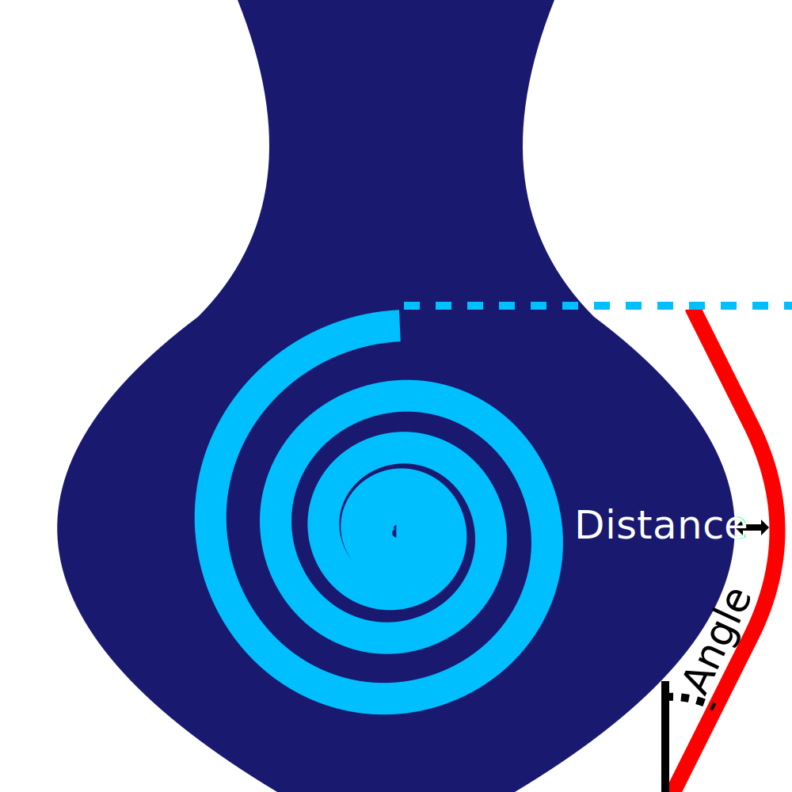

Winkel für Sickerschutz
====
Der Sickerschutz wird der Form des Modells folgen. Er muss nahe am Modell bleiben, da sonst auf dem Weg vom Schutz zum Modell neues Material austritt. Das Modell kann jedoch horizontale Flächen haben, was zu steilen Überhängen im Sickerschutz führen würde. Diese Einstellung begrenzt die Steilheit des Sickerschutz, damit er nicht in sich zusammenfällt.

* Ein Wert von 0 bewirkt, dass der Sickerschutz völlig senkrecht um die gesamte Form herum verläuft. Je kleiner der Winkel ist, desto stabiler ist der Schutz.
* Ein Wert von 90 bewirkt, dass der Sickerschutz dem Modell genau folgt. Je größer der Winkel ist, desto besser verhindert der Sickerschutz das Sickern auf das Modell.

Obwohl es theoretisch sinnvoll wäre, hier einen ähnlichen Wert wie für den [Winkel für Überhänge Stützstruktur](../support/support_angle.md) zu verwenden, ist der Sickerschutz nur eine einzelne Linie. Diese einzelne Linie ist schwächer als dein Modell und unterliegt eher der Verformung. Es ist gut, einen etwas flacheren Winkel als den zu verwenden, der normalerweise in Ihrem Modell gut gedruckt wird, um zu verhindern, dass sich der Sickerschutz spaltet.