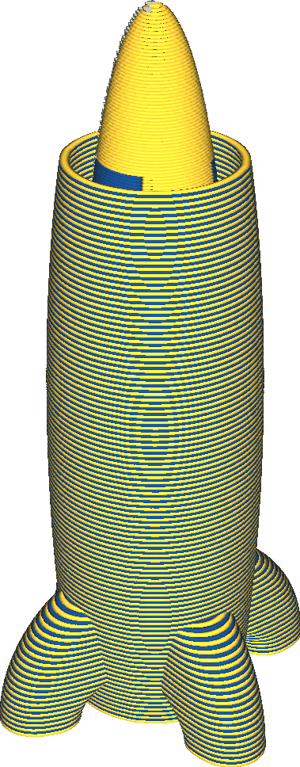

Sickerschutz aktivieren
====
Wenn mit mehreren Extrudern gedruckt wird, befindet sich in den inaktiven Extrudern manchmal noch etwas Material. Wenn die Düsen noch heiß sind, neigt dieses Material dazu, herauszusickern. Das ist das Problem, das der Sickerschutz verhindern soll. Der Sickerschutz ist ein Rand um das Objekt, der den Ausfluss unter der Düse auffängt.

<!--screenshot {
"image_path": "ooze_shield.png",
"models": [
    {
        "script": "rocket_dual.scad",
        "scad_params": ["extruder=0"],
        "object_settings": {
            "extruder_nr": 0
        },
        "transformation": ["scale(0.5)"]
    },
    {
        "script": "rocket_dual.scad",
        "scad_params": ["extruder=1"],
        "object_settings": {
            "extruder_nr": 1
        },
        "transformation": ["scale(0.5)"]
    }
],
"camera_position": [-62, 102, 87],
"settings": {
    "ooze_shield_enabled": true,
    "layer_height": 0.2,
    "line_width": 0.6
},
"colour_scheme": "material_colour",
"colours": 64
}-->

Der Sickerschutz druckt bis zur Höhe des höchsten Extruderschalters. Oberhalb dieser Höhe wird keine Düse in den Druck bewegt, nachdem sie sich im Standby-Modus befunden hat, so dass der Druck eines Sickerschutz unnötig ist. Der Sickerschutz wird mit dem Extruder gedruckt, der auf einer Schicht beginnt. Dieser Extruder wechselt jede Schicht, was eine Gefahr darstellt, wenn man mit zwei verschiedenen Materialien arbeitet, die nicht gut aneinander haften. Wird er jedoch später gedruckt, wenn der andere Extruder aktiviert wird, wird der Effekt der Sickerschutz weitgehend zerstört.

Der Sickerschutz ist dünn genug, um ihn leicht zu brechen oder zu schneiden, und hält seinen Abstand zum Modell, so dass er entfernt werden kann, ohne die Oberfläche zu beschädigen.