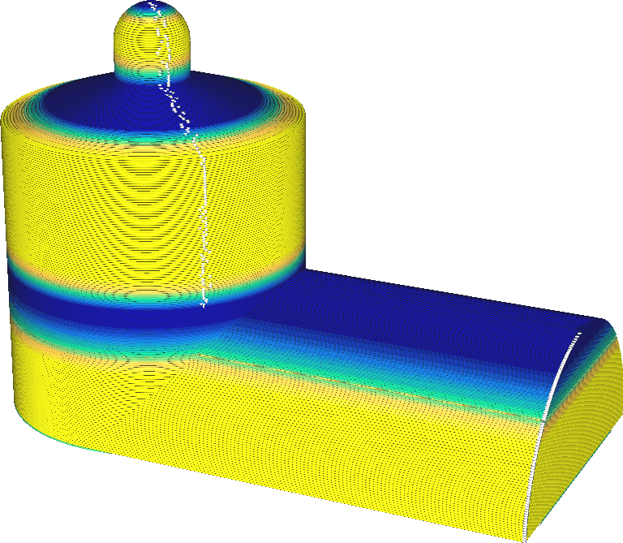

Anpassschichten verwenden
====
Anpassschichten passt die Schichtdicke Ihres Drucks lokal an, um Druckzeit und Qualität auf der Grundlage der Oberflächenmerkmale des Modells zu optimieren. Die Schichten werden dünner gemacht, wenn es flache Abhänge gibt, oder dicker, wenn die Wände steil sind. Das Ziel ist es, schnell zu drucken, wo es möglich ist, und dennoch detailliert zu drucken, wo es nötig ist.

<!--screenshot {
"image_path": "adaptive_layer_height_enabled.png",
"models": [{"script": "barn.scad"}],
"camera_position": [-108, -229, 118],
"settings": {
    "adaptive_layer_height_enabled": true,
    "layer_height": 0.2
},
"colour_scheme": "layer_thickness",
"colours": 128
}-->

Die Schichthöhe wird so eingestellt, dass der horizontale Abstand zwischen den Kanten der Schichten konstant bleibt. Bei flachen Oberflächen kommt es zu einer großen horizontalen Verschiebung mit einer kleinen vertikalen Verschiebung, so dass eine kleine vertikale Verschiebung vorgenommen wird, um die horizontale Verschiebung konstant zu halten. Bei steilen Oberflächen gibt es eine kleine horizontale Verschiebung mit einer großen vertikalen Verschiebung, so dass eine große vertikale Verschiebung vorgenommen wird, um die horizontale Verschiebung konstant zu halten. Auf diese Weise wird die topografische Wirkung der Schichten konstant gehalten. Der maximale Abstand zwischen zwei benachbarten Schichten wird auf einem konstanten Abstand der Einstellung [Topographische Größe der Anpassschichten](adaptive_layer_height_threshold.md) gehalten.

Wenn das Modell sowohl flache Oberflächen als auch steile Oberflächen in derselben Höhe aufweist, wird die Schichtdicke als die kleinere der beiden Schichten angenommen. Dadurch wird die Höhe der Schicht manchmal unnötig klein, weil eine horizontale Fläche daneben liegt. Dies ist im obigen Screenshot zu sehen, ebenso wie die halbe Höhe des Silos auf der linken Seite.

Anpassschichten sind stark eingeschränkt, um die Druckqualität zu verbessern. Die Höhe der Schicht darf nicht mehr als eine bestimmte [Maximale Abweichung](adaptive_layer_height_variation.md) von der ursprünglichen [Schichtdicke](../resolution/layer_height.md) Einstellung abweichen. Zwischen zwei benachbarten Schichten darf der Unterschied in der Schichthöhe nicht mehr als eine bestimmte [Schrittgröße](adaptive_layer_height_variation_step.md) betragen. Dies bewirkt, dass die Schichtdicke allmählich übergeht, anstatt sie plötzlich von einer Schicht zur nächsten zu halbieren.

Mit adaptiven Schichten kann die Druckzeit erheblich verkürzt werden, ohne dass die Druckqualität darunter leidet, in manchen Fällen sogar bei verbesserter Qualität. Die Auswirkungen der Anpassung der Schichtdicke sind immens. In den meisten Fällen wird die Druckzeit durch die Verwendung dickerer Schichten an den Stellen, an denen das Modell senkrecht steht, erheblich verkürzt. Der [Topographie-Effekt](../troubleshooting/topography.md) wird ebenfalls reduziert, da die Schichten horizontal enger beieinander liegen.

Diese Funktion kann jedoch auch eine Reihe von Problemen mit sich bringen.
* Mit der Änderung der Schichthöhe müssen in der Regel auch einige andere Einstellungen angepasst werden, z. B. die Düsentemperatur. Anpassschichten passen diese nicht automatisch mit an. Dies kann dazu führen, dass z. B. Überhänge, die bei einer niedrigeren Drucktemperatur besser gedruckt würden, nicht optimal gedruckt werden.
* Wenn die Schichthöhe für ein kleines Feature irgendwo in einem kleinen Teil der Schicht über die gesamte Schicht hinweg geändert wird, sind im Rest der Schicht Streifenbildungen sichtbar.
* Auch die vertikalen Abstände werden dadurch ungewollt angepasst. Dies kann sich negativ auf die Druckqualität auswirken. Zum Beispiel wird die [Obere/untere Dicke](../top_bottom/top_bottom_thickness.md) typischerweise niedriger, weil Cura die Einstellung [Obere Schichten](../top_bottom/top_layers.md) als Wahrheit hält und die Schichten dünner werden. Dies kann zu Pillowing führen. Zu den betroffenen Einstellungen, die möglicherweise nicht mehr korrekt sind, gehören:
  * [Obere Dicke](../top_bottom/top_thickness.md)
  * [Untere Dicke](../top_bottom/bottom_thickness.md)
  * [Maximaler Winkel Außenhaut für Expansion](../top_bottom/max_skin_angle_for_expansion.md)
  * [Höhe stufenweise Füllungsschritte](../infill/gradual_infill_step_height.md)
  * [Höhe stufenweiser Füllungsschritt Stützstruktur](../support/gradual_support_infill_step_height.md)
  * [Füllschichtdicke](../infill/infill_sparse_thickness.md)
  * [Stützstruktur Füllschichtdicke](../support/support_infill_sparse_thickness.md)
  * [Z-Abstand der Stützstruktur](../support/support_z_distance.md)
  * [Dicke des Stützdachs](../support/support_roof_height.md)
  * [Dicke der Bodenstruktur](../support/support_bottom_height.md)
  * [Winkel für Überhänge Stützstruktur](../support/support_angle.md)
  * [Stufenhöhe der Stützstruktur](../support/support_bottom_stair_step_height.md)
  * [Winkel des Pfeilerdachs](../support/support_tower_roof_angle.md)
  * [Winkel für Sickerschutz](../dual/ooze_shield_angle.md)
  * [Maximaler Winkel des Modells](../experimental/conical_overhang_angle.md)