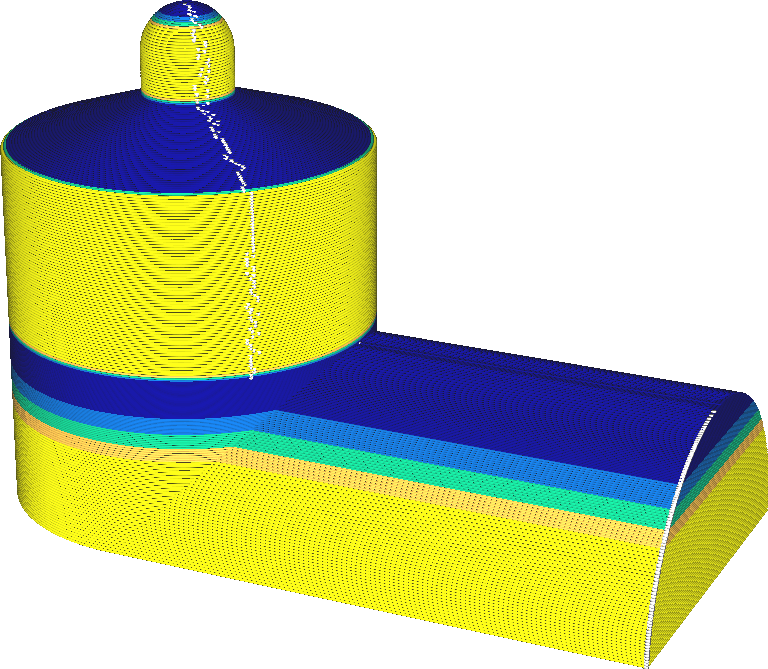

Abweichung Schrittgröße für Anpassschichten
====
Wenn sich die gewünschte Schichtdicke einer Schicht stark von der einer benachbarten Schicht unterscheidet, kommt es zu einem großen Unterschied in der Durchflussmenge aus der Düse, was zu Über- oder Unterextrusion führen kann. Diese Einstellung stellt sicher, dass der Unterschied in der Schichtdicke eine allmähliche Änderung ist, um dies zu verhindern. Mit dieser Einstellung können Sie die maximale Änderung der Schichtdicke zwischen zwei benachbarten Schichten festlegen.

<!--screenshot {
"image_path": "adaptive_layer_height_variation_step_0_05.png",
"models": [{"script": "barn.scad"}],
"camera_position": [-108, -229, 118],
"settings": {
    "adaptive_layer_height_enabled": true,
    "adaptive_layer_height_variation_step": 0.05,
    "layer_height": 0.2
},
"colour_scheme": "layer_thickness",
"colours": 128
}-->
<!--screenshot {
"image_path": "adaptive_layer_height_enabled.png",
"models": [{"script": "barn.scad"}],
"camera_position": [-108, -229, 118],
"settings": {
    "adaptive_layer_height_enabled": true,
    "layer_height": 0.2
},
"colour_scheme": "layer_thickness",
"colours": 128
}-->

Wenn Sie diese Einstellung verringern, wird die Schichtdicke allmählicher übergehen. Dies hat eine Reihe von Auswirkungen auf den Druck:
* Beim Übergang zu einer geringeren Schichtdicke wird weniger überextrudiert, da der Fluss aus der Düse Zeit hat, sich an eine geringere Flussrate anzupassen. Dadurch werden Kleckse auf der Oberfläche vermieden.
* Beim Übergang zu einer größeren Schichtdicke kommt es zu einer geringeren Unterextrusion, da sich der Durchfluss aus der Düse allmählich auf eine größere Durchflussmenge einstellen kann.
* Die Streifenbildung wird weniger sichtbar sein. Auch wenn Bereiche mit unterschiedlicher Schichtdicke immer noch eine unterschiedliche Textur und Farbe aufweisen, sind diese Bereiche nun weiter voneinander entfernt, so dass sie schwerer zu erkennen sind.
* An Stellen im Modell, an denen ein scharfer Winkel einen plötzlichen Übergang zu dünneren Schichten verursachen sollte, tritt der Topographieeffekt wieder auf. Das liegt daran, dass die Schichtdicke nicht so schnell angepasst werden kann, so dass für flache Oberflächen dickere Schichten verwendet werden müssen.
* Ähnlich verhält es sich, wenn das Modell einen scharfen Winkel aufweist, der einen plötzlichen Übergang zu dickeren Schichten bewirken sollte: Der Drucker erzeugt unnötig dünne Schichten und verschwendet damit Druckzeit, wo dies nicht nötig ist.

Aufgrund der Implementierung des Algorithmus für adaptive Schichten erfolgt der allmähliche Übergang zu einer anderen Schichtdicke immer *oberhalb* des Winkels im Modell, der den Übergang verursacht.