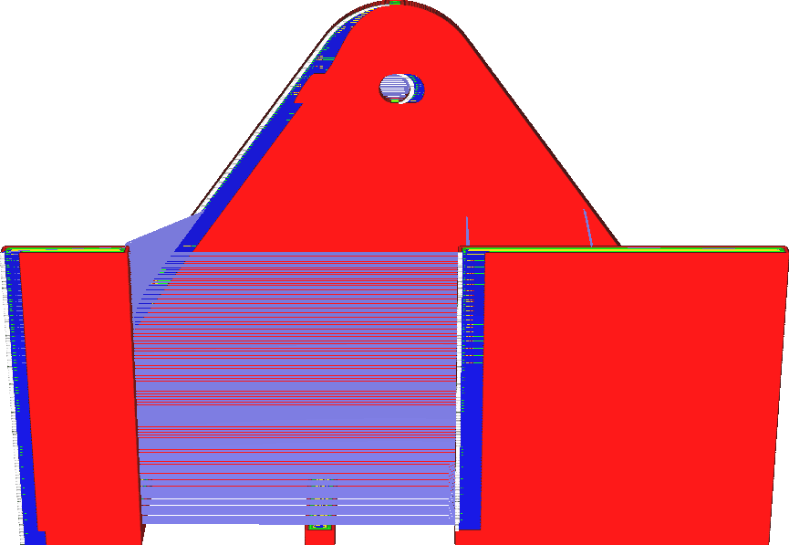

Coasting-Volumen
====
Diese Einstellung legt fest, wie weit vor dem Ende der Kontur der Förderer die Materialzufuhr stoppt. Die Länge des Coastings wird jedoch in einem Materialvolumen konfiguriert. Sie steht in engerem Zusammenhang mit dem Volumen in der Düsenkammer.

<!--screenshot {
"image_path": "coasting_enable.png",
"models": [{"script": "phone_holder.scad"}],
"camera_position": [0, -215, 117],
"minimum_layer": 1,
"structures": ["travels", "helpers", "shell", "infill", "starts"],
"settings": {
    "coasting_enable": true,
    "coasting_volume": 0.06
},
"colours": 32
}-->
<!--screenshot {
"image_path": "coasting_volume_0_03.png",
"models": [{"script": "phone_holder.scad"}],
"camera_position": [0, -215, 117],
"minimum_layer": 1,
"structures": ["travels", "helpers", "shell", "infill", "starts"],
"settings": {
    "coasting_enable": true,
    "coasting_volume": 0.03
},
"colours": 32
}-->

Eine Erhöhung des Coasting-Volumens führt dazu, dass die Düse aufhört, weiter zu extrudieren, bevor sie die Kontur beendet hat. Das Ergebnis ist eine stärkere Unterextrusion zum Ende hin. Die Funktion des Coastings besteht darin, den Blob beim Verschließen der Kontur zu kompensieren, so dass eine Erhöhung des Coasting-Volumens größere Blobs kompensieren kann.

Wird das Coasting-Volumen jedoch zu stark erhöht, führt dies zu einer starken Unterextrusion am Ende der Kontur. Es kann sogar zu einer gewissen Unterextrusion bei allem führen, was nach der Kontur gedruckt wird, da der Druck auf die Düse dann noch niedrig ist.