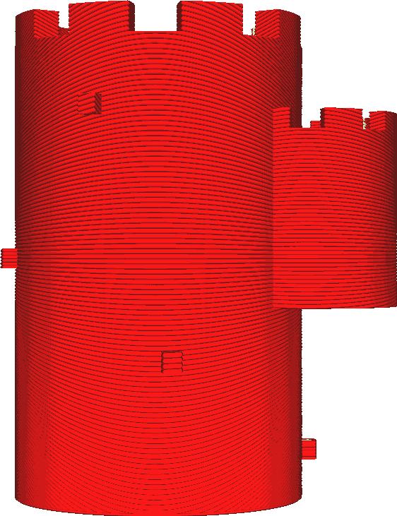

Überhänge druckbar machen
====
Mit dieser Einstellung wird Ihr Modell so transformiert, dass es keinen Überhang mehr hat. Es wird zusätzliches Material unter den Überhang gelegt und gedruckt, als ob es Teil des Modells wäre.

<!--screenshot {
"image_path": "conical_overhang_enabled_disabled.png",
"models": [{"script": "castle.scad"}],
"camera_position": [0, 189, 25],
"settings": {
    "conical_overhang_enabled": false
},
"colours": 8
}-->
<!--screenshot {
"image_path": "conical_overhang_enabled_enabled.png",
"models": [{"script": "castle.scad"}],
"camera_position": [0, 189, 25],
"settings": {
    "conical_overhang_enabled": true,
    "conical_overhang_angle": 50
},
"colours": 8
}-->

Unter alle überhängenden Teile wird Material gelegt, das nach unten hin immer kleiner wird. In vielen Fällen wird der Überhang zum Objekt selbst hin geneigt sein. Die Neigung, in welcher der Überhang zum Objekt hin wächst, wird durch den [Maximalen Winkel des Modells](conical_overhang_angle.md) bestimmt.

Mit dieser Einstellung lässt sich auf einfache Weise vermeiden, dass ein Support benötigt wird. Diese Einstellung ist besonders effektiv, wenn Modelle mit etwas rauen Oberflächen oder Reliefs an den Seiten gedruckt werden. Diese kleinen Überhangstücke würden normalerweise herunterhängen und lose Stränge von unzusammenhängenden Plastikfäden erzeugen. Sie können zwar mit etwas Support gestützt werden, aber das kann viel Zeit beim Drucken kosten und hinterlässt trotzdem einige Narben. Wenn diese Einstellung aktiviert ist, wird der Überhang nach unten zum Modell hin geglättet. Es sieht dann so aus, als ob es so gedruckt werden sollte.

Wenn der Überhang weiter vom Hauptkörper absteht, als er breit ist, kann trotzdem ein Überhang in Form einer Linie entstehen. Dies geschieht, weil der Überstand dann unendlich dünn geschrumpft wird, wodurch er verschwindet. In diesem Fall können Sie überlegen, ob es noch notwendig ist, Support zu drucken. Im Fall der obigen Bilder ist dies bei den kleinen Blöcken an der Seite des Turms der Fall, aber er ist so klein, dass er mit einer einfachen Überbrückung wahrscheinlich problemlos überhängen kann.