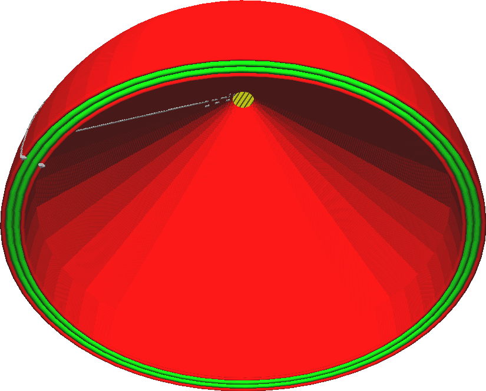

Maximaler Lochflächen-Überstand
====
Da mit der Einstellung [Überhänge druckbar machen](conical_overhang_enabled.md) jede Art von Überhang beseitigt wird, werden alle Brücken automatisch abgesenkt und der darunter liegende Überhang geschlossen. Wenn der Überhang jedoch von allen Seiten umschlossen ist, wird er so lange abgesenkt, bis der umschlossene Überhang vollständig aufgefüllt ist. Dies hat zur Folge, dass alle nach unten gerichteten Löcher vollständig aufgefüllt werden, selbst wenn der zu entfernende Überhang nur ein winziger Punkt ganz oben ist.

Um diesen Effekt zu verhindern, erlaubt diese Einstellung, dass der Überhang offen bleibt, wenn er an allen Seiten geschlossen und kleiner als eine bestimmte Fläche ist. Dies gilt nur für Löcher. Regulärer Überhang an der Außenseite des Modells wird weiterhin nach unten verlängert, um einen einigermaßen druckbaren Winkel beizubehalten.

<!--screenshot {
"image_path": "conical_overhang_hole_size.png",
"models": [{"script": "plopper.scad"}],
"camera_position": [-86, 29, -85],
"settings": {
    "conical_overhang_enabled": true,
    "conical_overhang_hole_size": 20
},
"colours": 64
}-->

Bei den meisten Modellen ist es ziemlich sicher, diesen Wert auf einige Dutzend Quadratmillimeter einzustellen. Wird er zu niedrig eingestellt, wird das Modell stärker modifiziert, um Überhänge zu unterstützen, die eigentlich zu klein sind, um Unterstützung zu benötigen. Wird der Wert jedoch zu hoch angesetzt, ergeben sich erhebliche Überhangbereiche, die schwer zu überbrücken sein könnten.

Wenn es aufgrund dieser Einstellung große Überhangbereiche gibt, ist es eine gute Idee, zunächst die [Brückeneinstellungen](bridge_settings_enabled.md) zu prüfen, bevor man versucht, das Modell zu verändern, um den Überhang zu entfernen.