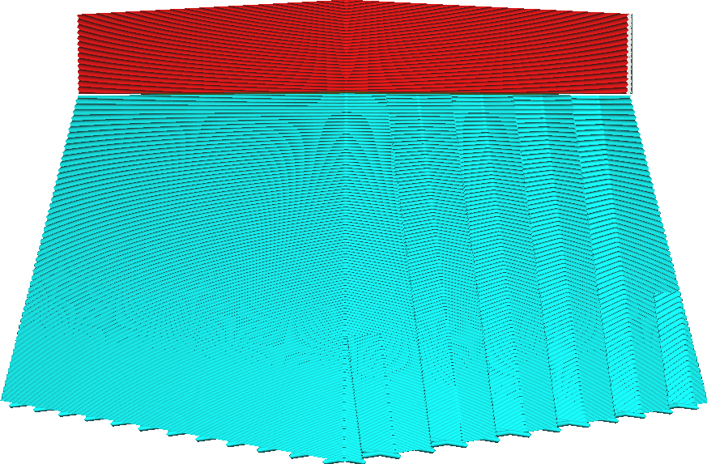

Winkel konische Stützstruktur
====
Diese Einstellung bestimmt den Neigungswinkel, mit dem die konische Stützstruktur gedruckt wird.

<!--screenshot {
"image_path": "support_conical_enabled.png",
"models": [
    {
        "script": "wide_overhang.scad",
        "transformation": ["scale(0.5)"]
    }
],
"camera_position": [91, -95, 19],
"settings": {
    "support_enable": true,
    "support_conical_enabled": true,
    "support_conical_angle": 30
},
"colours": 64
}-->
<!--screenshot {
"image_path": "support_conical_angle_10.png",
"models": [
    {
        "script": "wide_overhang.scad",
        "transformation": ["scale(0.5)"]
    }
],
"camera_position": [91, -95, 19],
"settings": {
    "support_enable": true,
    "support_conical_enabled": true,
    "support_conical_angle": 10
},
"colours": 64
}-->
<!--screenshot {
"image_path": "support_conical_angle_neg10.png",
"models": [
    {
        "script": "wide_overhang.scad",
        "transformation": ["scale(0.5)"]
    }
],
"camera_position": [91, -95, 19],
"settings": {
    "support_enable": true,
    "support_conical_enabled": true,
    "support_conical_angle": -10
},
"colours": 64
}-->

The conical support angle is the most major trade-off between the stability of support and how much support is generated.

Wenn Sie einen großen Winkel verwenden, wird der Support über einen großen Teil seiner Höhe sehr dünn. Das spart eine Menge Support-Material und Druckzeit. Wenn viel Support-Material benötigt wird, kann dies viel Zeit und Material sparen, da mehr als die Hälfte des Supports weggelassen wird. Da der Support im unteren Bereich jedoch sehr dünn wird, kann der Support auch weniger stabil werden, was die Wahrscheinlichkeit erhöht, dass der Druck fehlschlägt. Um dies zu vermeiden, können Sie die [Mindestbreite](support_conical_min_width.md) erhöhen.

Wenn Sie einen negativen Winkel verwenden, wird der Support nach unten hin breiter und hat die Form eines Vulkans. Wenn Ihr Druck winzige, weit oben liegende Elemente enthält, die unterstützt werden müssen, entstehen normalerweise sehr hohe [Pfeiler](../support/support_use_towers.md), die während des Drucks leicht umfallen können. Mit einem negativen Winkel werden diese hohen, dünnen Support-Strukturen nach unten hin breiter. Das gibt ihnen zusätzliche Stabilität. Es dauert jedoch länger, diese Supports zu drucken, da mehr Material benötigt wird. Ein Winkel von etwa -5° reicht normalerweise aus, um selbst den höchsten und dünnsten Support-Strukturen genügend Stabilität zu verleihen. Wenn Ihr Material dazu neigt, bei Fahrbewegungen stark zu sickern, ist ein größerer negativer Winkel erforderlich, da die Struktur durch die Blobs auf dem Support stärker belastet wird.