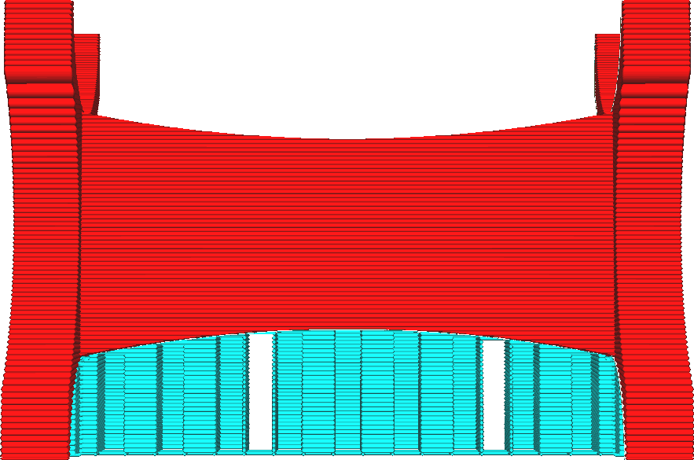

Stützstruktur in Blöcke aufteilen
====
Wenn das Zickzack-[Muster](../support/support_pattern.md) für den Support verwendet wird, kann der Support einfach zerknüllt werden, um ihn zu entfernen. Dies wird schwieriger, wenn der Support sehr breit ist. Bei dieser Einstellung wird der Zickzack-Support in Stücke zerlegt, die sich leichter einzeln abreißen lassen, aber immer noch breit genug sind, um ihre Stabilität zu erhalten.

<!--screenshot {
"image_path": "support_skip_some_zags.png",
"models": [{"script": "rack.scad"}],
"camera_position": [0, 184, 10],
"settings": {
    "support_enable": true,
    "support_pattern": "zigzag",
    "support_skip_some_zags": true,
    "support_skip_zag_per_mm": 20
},
"colours": 32
}-->

Wenn Sie den Support in Stücke aufteilen, ist es einfacher, den Support abzubrechen, da Sie den Support Stück für Stück abbrechen können. Dadurch wird die Festigkeit und Steifigkeit des Supports allerdings etwas verringert, insbesondere wenn die [Blockgröße](support_skip_zag_per_mm.md) sehr klein eingestellt ist. Infolgedessen besteht eine etwas größere Wahrscheinlichkeit, dass der Support umkippt, was zu stringing und schlechten Überhängen führt.

Diese Einstellung verhindert auch, dass der gesamte Support in einem Stück abgezogen wird. Bei vielen Stützen müssen diese einzeln abgenommen werden. Wenn sich die Stütze sonst leicht genug abziehen lässt, kann diese Einstellung das Abziehen der Stütze sogar erschweren (auch wenn es vielleicht immer noch einfacher ist).

Diese Einstellung lässt sich schlecht mit der [Anzahl der Wandlinien der Stützstruktur](../support/support_wall_count.md) kombinieren. Wenn der Support eine zusätzliche Wand um ihn herum hat, verbindet diese Wand die Teile wieder miteinander, was es schwieriger macht, Teile abzubrechen.