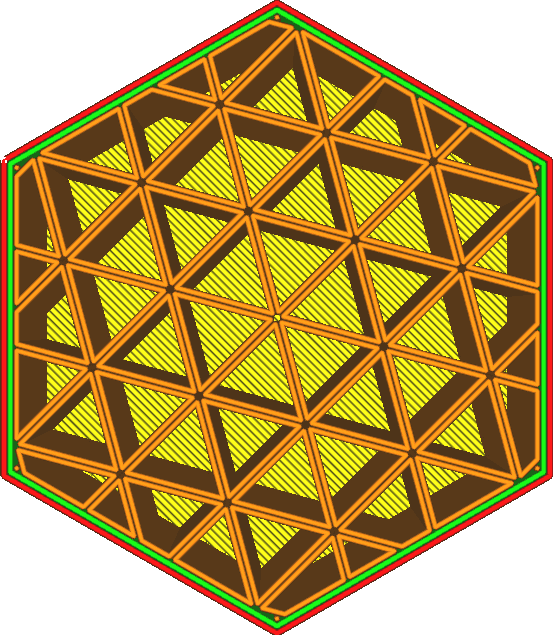
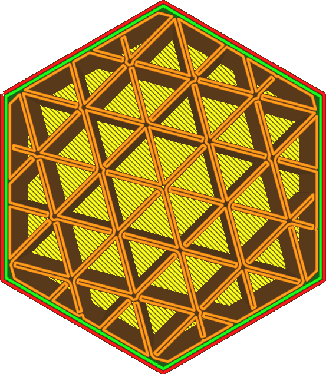

Füllungspolygone verbinden
====
Wenn die Füllung aus geschlossenen Linien besteht, können diese geschlossenen Linien zu einer einzigen Linie verschmolzen werden. Wenn Sie diese Funktion aktivieren, werden kleine Verbindungen zwischen benachbarten Polygonen hergestellt.

Diese Einstellung ist nur verfügbar, wenn die Füllung aus angrenzenden Linien besteht. Das bedeutet, dass entweder:
* Das [Füllmuster](infill_pattern.md) ist auf Kreuz oder Kreuz 3D eingestellt.
* Die Fülllinien sind mit einer geraden Zahl [multipliziert](infill_multiplier.md) .
* Es gibt mindestens 2 [zusätzliche Wände um die Füllung](infill_wall_line_count.md).

Das Ziel dieser Funktion ist es, Fahrwege zu verhindern. Die endgültige Linie besteht aus einer einzigen Schleife für jedes verbundene Teil der Füllung, so dass es keine Fahrwege geben wird. Dies erleichtert die Arbeit mit flexiblen Filamenten, da diese sich schwerer einziehen lassen und am besten funktionieren, wenn sie weiterhin durch die Düse fließen können.

Durch das Verbinden dieser Schleifen kann die Füllung auch stärker werden, da die Verbindung zwischen den Schleifen im Inneren verbessert wird. Wenn die Polygone verbunden sind, muss der Druckkopf jedoch oft kurz vor einer Verbindung eine 180-Grad-Drehung machen. Diese Drehungen verhindern manchmal, dass die Verbindung vollständig hergestellt werden kann. Dies kann in manchen Fällen auch dazu führen, dass die Füllung schwächer wird. Es hängt alles davon ab, wie die Schleifen durch die Form Ihres Modells ineinandergreifen.