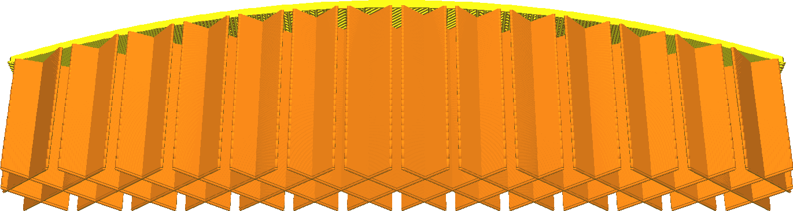
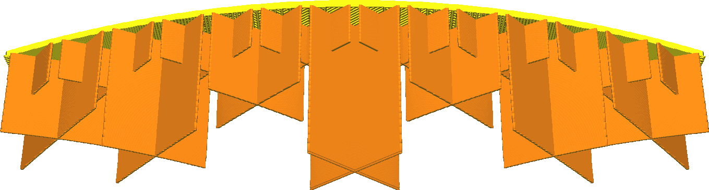

Stufenweise Füllungsschritte
====
Bei der schrittweisen Füllung wird die Menge der Füllung reduziert, indem die Dichte der Füllung in den unteren Schichten verringert wird. Dies spart Druckzeit und Material, ohne die Oberflächenqualität wesentlich zu beeinträchtigen. Der Hauptzweck von Füllungen beim Drucken in optischer Qualität ist die Unterstützung der oberen Fläche. Mit dieser Funktion wird die Füllung nur auf diesen Zweck ausgerichtet.

Diese Einstellung gibt an, in wie vielen Schritten die Fülldichte reduziert wird. Bei jedem Schritt wird die Fülldichte halbiert. Wenn Sie z. B. mit einem Füllgrad von 20 % und zwei schrittweisen Füllungen beginnen, beträgt die Fülldichte der unteren Teile 10 % bzw. 5 %.

**Das Häkchen bei "Stufenweise Füllungsschritte" im empfohlenen Modus setzt diese Einstellung auf 5 Stufen und erhöht die Fülldichte auf 90 %. Dies führt zu einer sehr hohen Dichte am oberen Rand (90 %) und einer sehr niedrigen Dichte am unteren Rand des Drucks (2,8 %).**