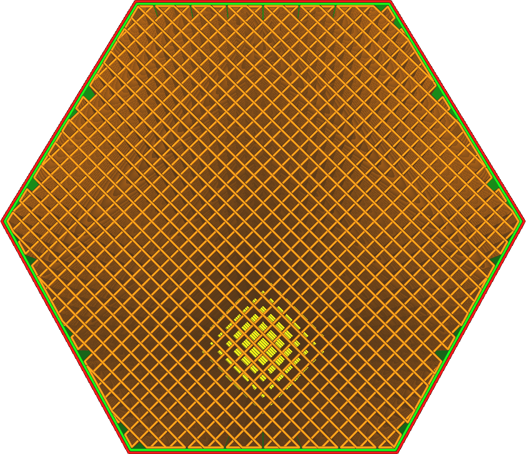
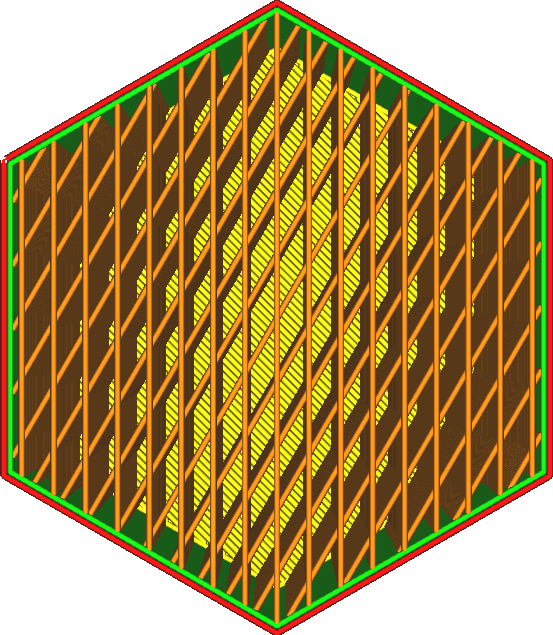

Linienrichtungen Füllung
====
Die Fülllinien werden in der Regel in einem Winkel von möglichst 45 Grad ausgerichtet. Bei diesem Winkel arbeiten sowohl der X- als auch der Y-Motor zusammen, um eine maximale Beschleunigung des Druckkopfs zu erreichen, wenn ein Drucker mit dem üblichen Cartesian Gantry-Mechanismus verwendet wird.

Mit dieser Einstellung können Sie diesen Winkel anpassen. Sie können ihn individuell einstellen, um eine größere Kraft für Ihr spezifisches Modell zu erzeugen oder eine größere Beschleunigung für Ihr spezifisches Gantry-System zu erreichen (z. B. für Delta-Drucker).

Der Wert dieser Einstellung muss eine durch Kommata getrennte Liste mit Winkeln sein, die von eckigen Klammern umgeben ist. Ein Winkel von 0 Grad ergibt eine Linie parallel zur Y-Achse. Diese Werte werden abwechselnd über die Schichten verteilt.
* Der endgültige Druck ist am stärksten in den Richtungen der Fülllinien. Wenn der Druck eine bestimmte Kraft in einer horizontalen Richtung ausüben soll, ist es sinnvoll, die Fülllinien um diese Richtung herum auszurichten.
* Lassen Sie die Einstellung als leere Liste stehen, um die Standardeinstellung zu verwenden.
* Die Voreinstellung hängt vom Füllmuster ab:
  * Für Kreuz- und Kreuz-3D-Infill-Muster ist die Voreinstellung [22]. Dadurch werden so viele Linien wie möglich nahe an den Diagonalen ausgerichtet.
  * Bei Linien- und Zickzack-Füllmustern ist der Standardwert [45,135]. Dies bewirkt, dass die Ausrichtung Schicht für Schicht zwischen den beiden Diagonalen wechselt.
  * Bei allen anderen Mustern ist der Standardwert [45]. Damit werden so viele Linien wie möglich nahe an den Diagonalen ausgerichtet.
