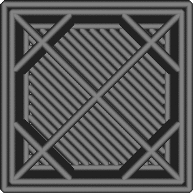

Füllung vor Wänden
====
Dies beeinflusst die Reihenfolge, in der die Teile gedruckt werden. Wenn diese Einstellung aktiviert ist, wird die Füllung eines Teils gedruckt, bevor die Wände dieses Teils in der jeweiligen Schicht gedruckt werden.

Diese Einstellung ist ein Kompromiss zwischen Genauigkeit und Festigkeit:
* Wenn die Wände vor der Füllung gedruckt werden, kann es sein, dass die Wände nichts haben, woran sie sich festhalten können, so dass sie stärker nachgeben. Allerdings sind die Wände dann bereits erstarrt und werden nicht von der Füllung weggedrückt, so dass die Füllung nicht durch die Wände hindurchscheinen kann.
* Wenn die Füllung vor den Wänden gedruckt wird, werden die Wände an den Stellen, an denen die Füllung an den Wänden befestigt ist, weggedrückt, wodurch die Wände ungenauer werden und die Füllung durch die Oberfläche durchscheinen kann, wodurch ein Muster entsteht, das von außen sichtbar ist. Die Füllung hält die Wände jedoch besser in Position, während sie gedruckt werden.