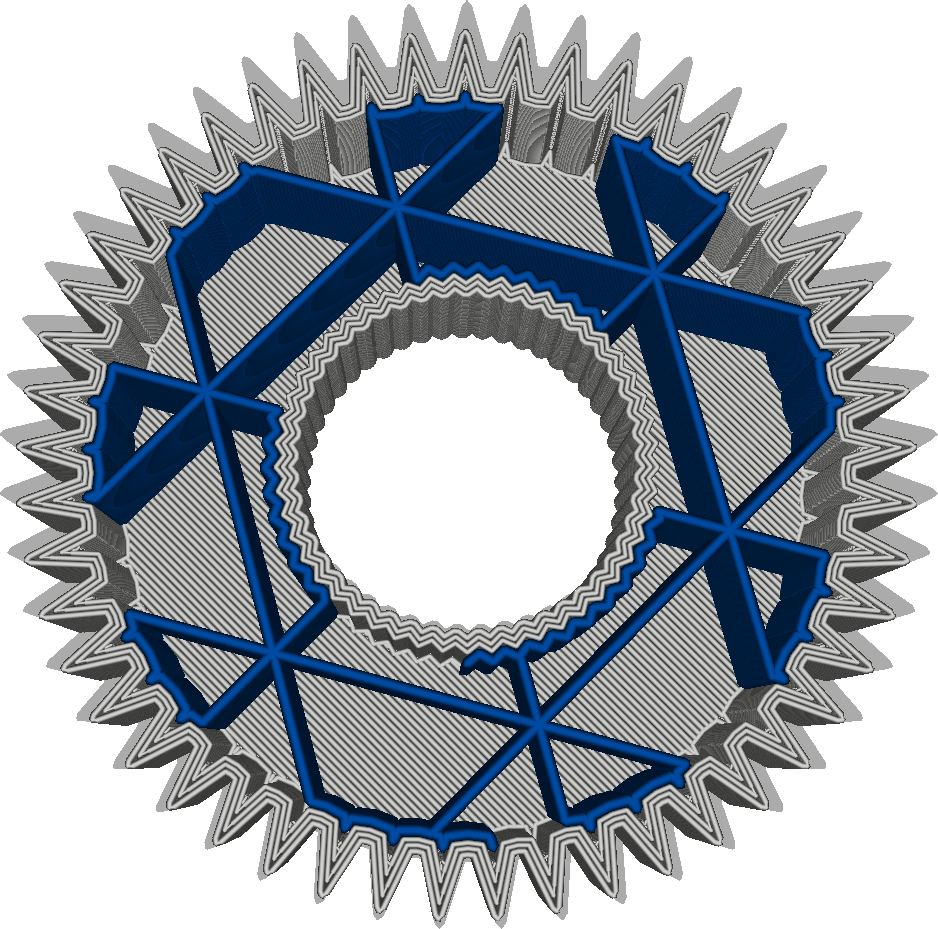

Extruder für Füllung
====
Diese Einstellung legt fest, welcher Extruder zum Drucken der Füllung verwendet werden soll. Diese Einstellung ist nur für Drucker mit mehreren Extrudern verfügbar.

Wenn Ihr Drucker für jeden Extruder eine andere Düse verwenden kann, können Sie die Füllung mit einer größeren Düse drucken, um die Druckgeschwindigkeit und -stärke zu erhöhen, ohne die optische Qualität der Außenhaut zu beeinträchtigen.