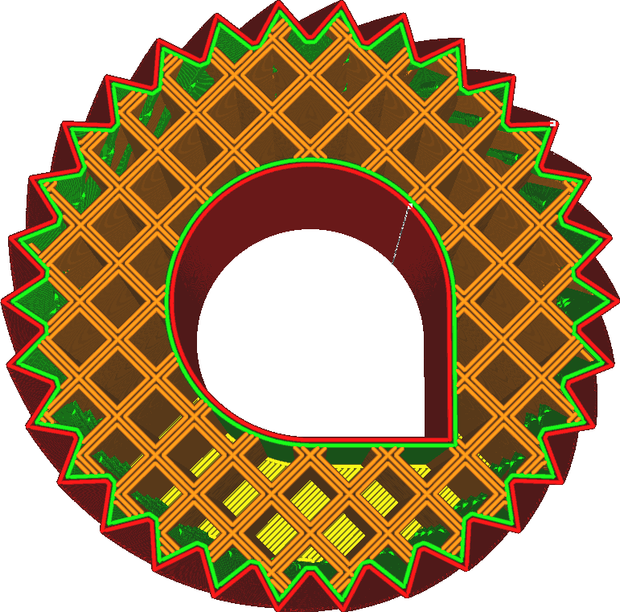

Fülllinie multiplizieren
====
Wenn Sie diese Einstellung erhöhen, wird Cura mehr Fülllinien direkt neben den anderen Fülllinien platzieren.

Dadurch wird die Fülldichte über die in der Einstellung [Fülldichte](infill_sparse_density.md) angegebene Dichte hinaus erhöht, aber anstatt die Fülllinien gleichmäßig zu verteilen, werden sie direkt nebeneinander platziert. Im Vergleich zu einer einfachen Erhöhung der Fülldichte kann dies die Stabilität der Füllung erhöhen, da sich die Fülllinien aneinander anlehnen können, um zusätzliche Stabilität zu erhalten.

Wenn ein ungerader Multiplikator eingestellt wird, bleiben die ursprünglichen Fülllinien an Ort und Stelle, zusätzliche Fülllinien werden dagegen in die Löcher des Füllmusters eingefügt. Wenn ein gerader Multiplikator eingestellt wird, werden die ursprünglichen Fülllinien entfernt und die Linien werden direkt an ihrer Stelle platziert.

Verglichen mit der Alternative, die Fülldichte um den gleichen Multiplikator zu erhöhen, hat dies mehrere Auswirkungen auf Ihren Druck.
* Die Füllung wird insgesamt steifer, ähnlich wie bei der Erhöhung der Breite der Fülllinien, da sich die Fülllinien bei Scherkräften aneinander abstützen können.
* Die Füllung scheint stärker durch die Außenhaut hindurch, was die Oberflächenqualität verringert.
* Die Lücken zwischen den Fülllinien sind größer, da die Linien stärker gebündelt sind. Dadurch hängt die Außenhaut stärker durch und kann sich wölben.

**Diese Einstellung hat keine Auswirkung, wenn die Fülldichte 100% oder höher ist.**