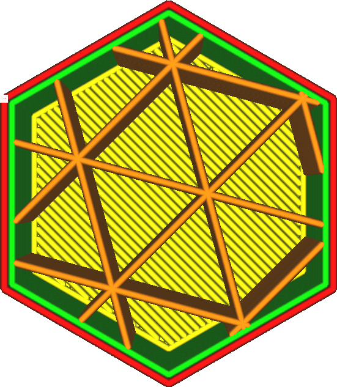

X-Versatz Füllung
====
Normalerweise werden die Füllmuster auf die Mitte des 3D-Modells zentriert. Diese Einstellung ermöglicht zusammen mit dem [Y-Versatz Füllung](infill_offset_y.md) eine Verschiebung des Mittelpunkts des Musters. Mit dieser Einstellung wird die X-Koordinate des Mittelpunkts angepasst.

Wenn Sie mit geringer Fülldichte drucken, können Sie damit die Füllung sehr genau positionieren, so dass die einzelnen Fülllinien dort platziert werden, wo die Stärke am meisten benötigt wird.