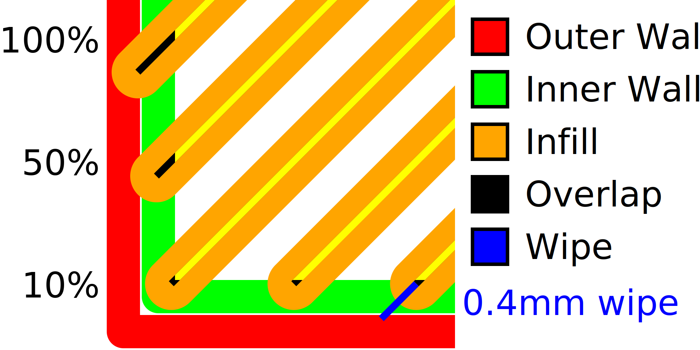

Füllung überlappen
====
Wenn die Füllung ein wenig mit den Wänden überlappt, haftet sie besser an den Wänden, wodurch das Teil viel stabiler wird. Diese Einstellung steuert, wie stark die Füllung die Wände überlappt.

* Je größer die Überlappung, desto besser haftet die Füllung an den Wänden und desto stärker ist das Teil.
* Es führt jedoch auch dazu, dass die Füllung durch die Wände hindurchscheint, was zu einem Muster auf der Oberfläche des Drucks führt. Dies mindert die optische Qualität der Oberfläche.