Füllmuster
====
Das Füllmuster definiert eine Struktur, mit der das Objekt ausgefüllt wird. Es stehen verschiedene Muster zur Verfügung, von denen jedes seine eigenen Vorteile hat. Einige sind für ganz bestimmte Anwendungen vorgesehen.

Gitter
----

Das Gitter-Füllmuster erzeugt zwei senkrecht zueinander stehende Linien. Zusammen bilden sie ein Muster aus Quadraten.
* Stärkstes Muster in der vertikalen Richtung.
* Ziemlich stark in den beiden Richtungen der Linien.
* Nicht so stark in der Diagonale.
* Sehr guter Support für die Oberfläche. Ihre Oberfläche wird sehr glatt aussehen.

Linien
----
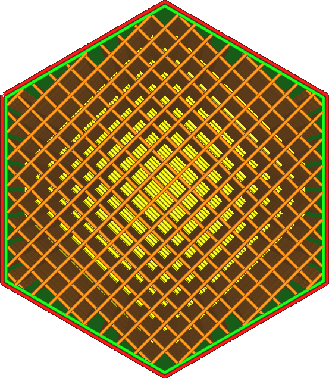

Das Linienmuster erzeugt parallele Linien. Standardmäßig wechselt das Linienmuster seine Richtung senkrecht von Schicht zu Schicht, so dass es auf den ersten Blick wie das Gittermuster aussieht. Dies kann jedoch mit der Einstellung [Linienrichtungen Füllung](infill_angles.md) geändert werden.
* Das beste Muster für eine glatte Oberfläche zusammen mit Zickzack, da der Abstand zwischen den Linien am geringsten ist.
* Neigt dazu, in der vertikalen Richtung schwach zu sein, da die Schichten nur kleine Punkte haben, an denen sie sich verbinden.
* In horizontaler Richtung ist sie extrem schwach, außer in der einen Richtung, in der die Linien ausgerichtet sind. Aber selbst in dieser Richtung ist es nicht besonders widerstandsfähig gegen Scherung, so dass es unter Belastung ziemlich schnell versagen wird.

Dreiecke
----
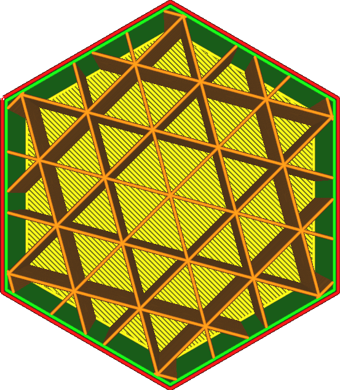

Mit dem Dreiecksmuster werden drei Sätze von Linien in drei verschiedenen Richtungen erzeugt. Zusammen bilden sie ein Muster aus Dreiecken.
* Sehr widerstandsfähig gegen Scherung.
* Ungefähr gleiche Festigkeit in jeder horizontalen Richtung.
* Die Oberlinien müssen sehr lange überbrücken, was viele Schichten der Außenhaut erfordert, um eine gleichmäßige Oberfläche zu erhalten.
* Die Fließbewegung wird an den Kreuzungspunkten erheblich unterbrochen, was zu einer relativ geringen Festigkeit bei hohen Füllraten führt.

Tri-Hexagon
----
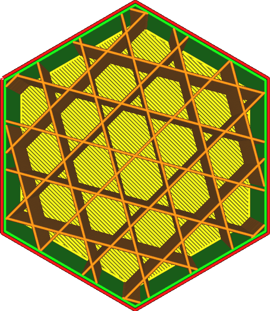

Das Tri-Hexagon-Muster erzeugt drei Sätze von Linien in drei verschiedenen Richtungen, genau wie das Dreiecksmuster, aber versetzt zueinander, so dass sie sich nicht alle an der gleichen Stelle schneiden.
* Stärkstes Muster in der horizontalen Richtung.
* Ungefähr gleiche Stärke in jeder horizontalen Richtung.
* Sehr widerstandsfähig gegen Scherung.
* Die Oberlinien müssen sehr lange überbrücken, was viele Schichten der Außenhaut erfordert, um eine gleichmäßige Oberfläche zu erhalten.

Würfel
----
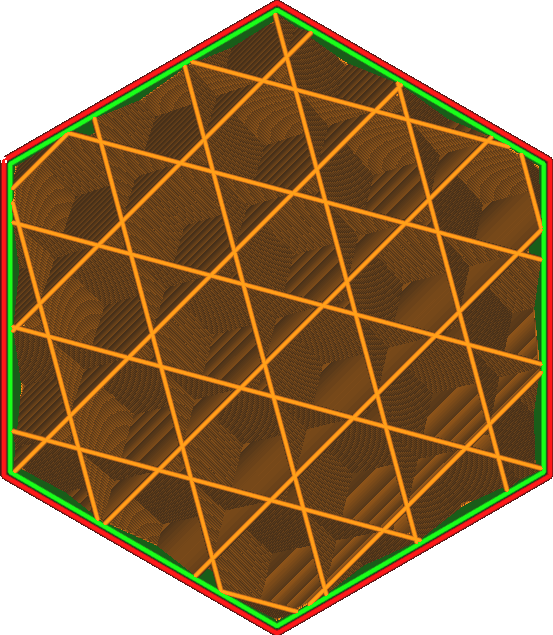

Das Muster erzeugt Würfel, ein 3-dimensionales Muster. Die Würfel werden an einer Ecke stehend ausgerichtet, so dass sie ohne überhängende Innenflächen gedruckt werden können.
* Ungefähr gleiche Stärke in jeder Richtung, auch in der vertikalen Richtung.
* Ziemlich stark in jeder Richtung.
* Geringerer Pillowing-Effekte, da keine langen vertikalen Hohlräume mit heißer Luft entstehen.

Würfel-Unterbereich
----
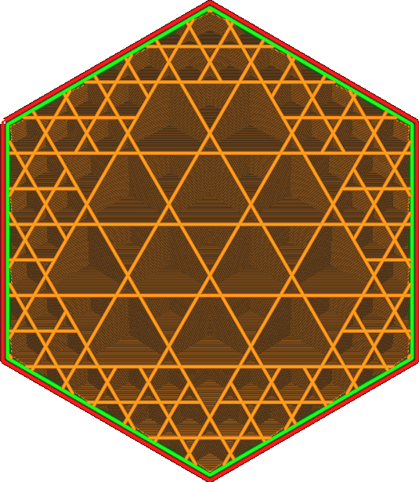

Das Würfel-Unterbereichmuster erzeugt Würfel, ein 3-dimensionales Muster. Die Würfel werden an einer Ecke stehend ausgerichtet, so dass sie ohne überhängende Innenflächen gedruckt werden können. Allerdings erzeugt dieses Muster größere Würfel im Inneren des Volumens, was Material spart. Es lässt die Fülllinien dort weg, wo sie am wenigsten nützlich sind.

Dieses Muster kann zu einer geringeren Fülldichte als gewünscht führen. Es ist ratsam, die Fülldichte bei Verwendung dieses Musters drastisch zu erhöhen. Die Optimierung funktioniert am besten bei hohen Füllraten.

Dieses Muster wird algorithmisch erzeugt, indem ein riesiger Würfel um das gesamte Volumen herum erzeugt wird, der dann in 8 Unterwürfel unterteilt wird, wenn er auf eine Wand trifft. Dieser Vorgang wird dann wiederholt, so dass die Unterwürfel, die auf eine Wand treffen, immer wieder unterteilt werden. Dies wird so lange wiederholt, bis der Abstand der Fülllinien erreicht ist.
* Stärkstes Muster nach Gewicht und Druckzeit.
* Ungefähr gleiche Stärke in jeder Richtung, auch in der vertikalen Richtung.
* Die Füllung wird in dünnen Teilen zusammengefasst.
* Geringerer Pillow-Effekt, da keine langen vertikalen Hohlräume mit heißer Luft entstehen.
* Wenn eine höhere Fülldichte verwendet wird, scheint die Füllung nicht so sehr durch die Wände hindurch, was eine bessere Oberflächenqualität bei gleicher Druckzeit ergibt.
* Führt zu Einzügen, was bei flexiblen oder fließenden Materialien nicht gut funktioniert.
* Das Slice-Verfahren dauert länger.

Octet
----
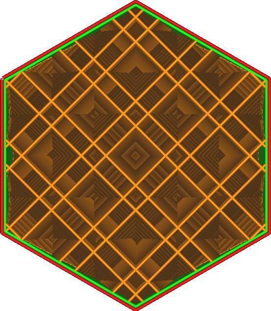

Das Octetmuster erzeugt eine Kombination aus regelmäßigen Vierecken und Würfeln, ein 3-dimensionales Muster. In regelmäßigen Abständen werden mehrere Fülllinien nebeneinander platziert.
* Dadurch entsteht ein starker innerer Rahmen, in dem sich mehrere parallele Linien berühren. Die Last wird schnell in Richtung dieses inneren Rahmens abgeleitet.
* Stark bei Modellen mit einer mittleren Dicke von etwa einem Zentimeter.
* Reduziert den Pillow-Effekt, da es keine langen Hohlräume mit heißer Luft entstehen.
* Führt zu einer sehr langen Überbrückungsstrecke für die Außenhaut, was die Qualität der Oberfläche beeinträchtigt.

Viertelwürfel
----
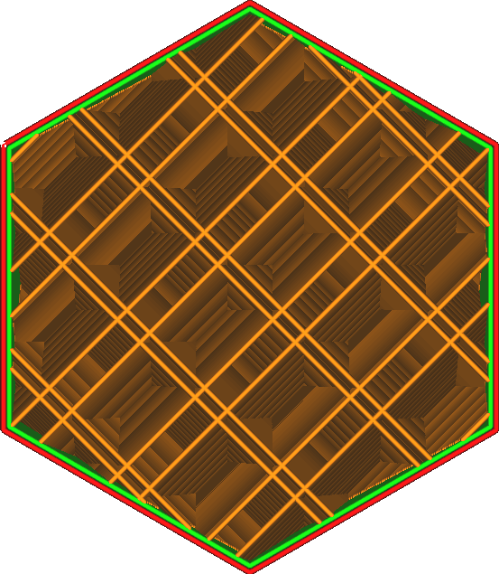

Das Viertelwürfel Muster erzeugt eine dreidimensionale Mosaikstruktur, die aus Vierecken und abgeschnittenen Vierecken besteht. Gelegentlich werden mehrere Fülllinien nebeneinander platziert.
* Es entstehen zwei getrennte innere Rahmen, ähnlich einem Octet, in denen sich mehrere parallele Linien berühren. Die Last wird schnell in Richtung dieses inneren Rahmens abgeleitet. Die Rahmen sind in zwei verschiedene Richtungen ausgerichtet, was sie einzeln schwächer macht, aber den Abstand zur Verteilung der Last auf diese Rahmen verringert.
* Stark bei Modellen mit einer geringen Dicke von einigen Millimetern.
* Reduziert den Pillow-Effekt, da es keine langen Hohlräume mit heißer Luft entstehen.
* Führt zu einer sehr langen Überbrückungsstrecke für die Außenhaut, was die Qualität der Oberfläche beeinträchtigt.

Konzentrisch
----
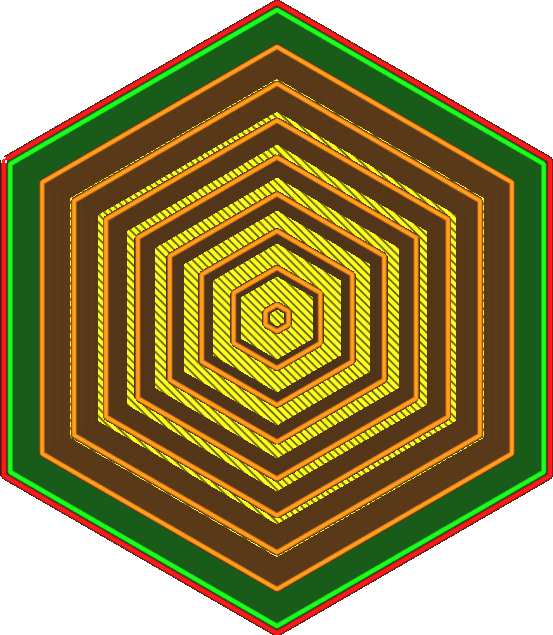

Das konzentrische Muster erzeugt Ringe parallel zu den Wänden.
* Das stärkste Füllmuster bei Verwendung von 100 % Füllung, da sich nicht nur keine Linien überschneiden, sondern die Linien auch so ausgerichtet sind, dass die nicht isotrope Stärke der Linien die Last gleichmäßig verteilt.
* Erzeugt die flexibelsten Drucke, mit einer sehr schwachen und gleichmäßigen Festigkeit in allen horizontalen Richtungen.
* Stärker in den Eckpunkten als in der Horizontalen.
* Bei einer Fülldichte von 100 % kann sich das Material in der Mitte stauen, was die Zuverlässigkeit des Drucks von runden Formen, bei denen die konzentrischen Kreise in einem Punkt zusammenlaufen, beeinträchtigt.
* Bei einigen Formen können einige der Fülllinien in der Luft hängen, was im Verhältnis zu den Kosten für Material und Druckzeit keine zusätzliche Stabilität bringt.
* Wenn Sie nicht 100 % Füllung verwenden, ist dies das schwächste Füllmuster in horizontaler Richtung. Es trägt überhaupt nicht zur Festigkeit bei.

Zickzack
----
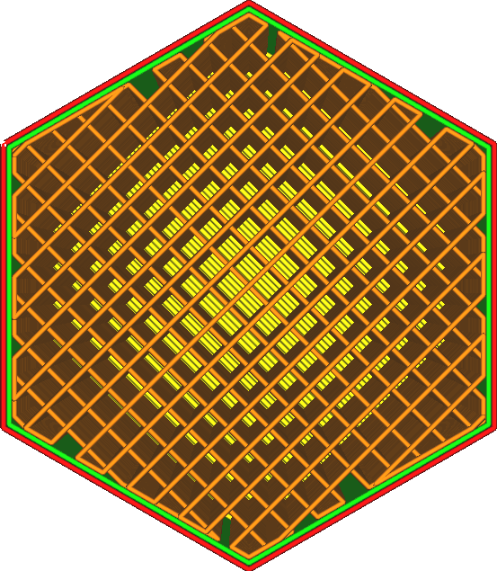

Das Zickzack-Füllmuster bewirkt, dass die Düse Linien in einem Zickzackmuster zeichnet. Dies ist ähnlich wie bei den Linien, aber die Linien sind in einer langen Linie miteinander verbunden, was Unterbrechungen des Flusses verhindert.
* Das zweitstärkste Füllmuster bei Verwendung von 100 % Füllung. Es druckt aber zuverlässiger als das konzentrische Füllmuster bei runden Formen.
* Das beste Muster für eine glatte Oberfläche, da der Abstand zwischen den Linien am geringsten ist.
* Neigt dazu, in der vertikalen Richtung ziemlich schwach zu sein, da die Schichten nur kleine Punkte haben, an denen sie sich miteinander verbinden.
* In horizontaler Richtung ist sie extrem schwach, außer in der einen Richtung, in der die Linien ausgerichtet sind. Aber selbst in dieser Richtung ist es nicht scherfest, so dass es unter Belastung ziemlich schnell versagen wird. 

Kreuz
----
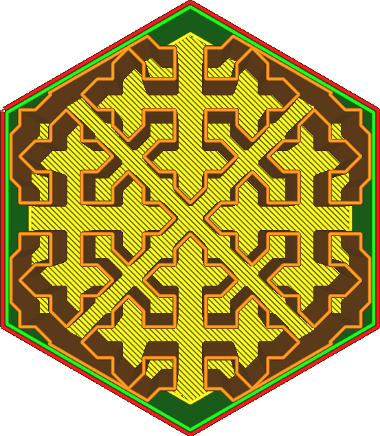

Das Kreuz-Füllmuster erzeugt eine raumfüllende Form, die an der Innenseite des Körpers wie Kreuze aussehen.
* Es ist in allen horizontalen Richtungen gleichmäßig geschmeidig und eignet sich daher für den Druck weicher und flexibler Objekte.
* Erzeugt keine langen geraden Linien in horizontaler Richtung, so dass es entlang des gesamten Umfangs gleichmäßig matschig ist. Es gibt keine starken Stellen.
* Erzeugt überhaupt keine Einzüge, was den Druck von flexiblen Materialien erleichtert.
* Ist in den Eckpunkten stärker als in der horizontalen Richtung.
* Slicing dauert sehr lange.
* In horizontalen Richtungen sehr weich.

Kreuz 3D
----
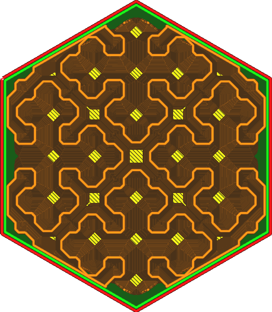

Das Füllmuster "Kreuz 3D" erzeugt eine raumfüllende Form, die an der Innenseite des Volumens wie Kreuze aussieht. Dieses Muster verläuft entlang der Z-Achse, damit es in der vertikalen Richtung schwächer wird.
* Ungefähr gleichmäßig biegsam in allen Richtungen, horizontal und vertikal, was dieses Muster zum Drucken weicher und flexibler Objekte am besten geeignet macht.
* Erzeugt keine langen geraden Linien, wodurch es auf der gesamten Oberfläche gleichmäßig weich wird.
* Erzeugt überhaupt keine Einzüge, was das Drucken mit flexiblen Materialien erleichtert.
* Slicing dauert sehr lange.
* Wird in alle Richtungen sehr weich sein. 

Gyroid
----
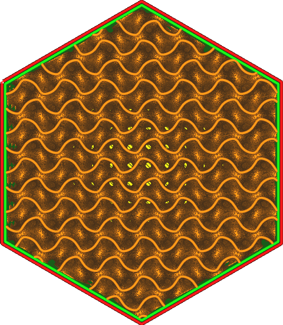

Das gyroide Füllmuster erzeugt ein wellenförmiges Muster, das die Richtungen wechselt.
* Dieses Muster erzeugt ein Volumen, das vollständig durchlässig für Flüssigkeiten ist, was es zu einem nützlichen Muster für auflösbare Materialien macht.
* Gleiche Festigkeit in allen Richtungen, aber nicht sehr stark. Dadurch eignet es sich für flexible Materialien, aber das Ergebnis wird etwas härter und weniger nachgiebig sein als die Cross (3D) Füllmuster.
* Widerstandsfähig gegen Scherung.
* Das Slicen nimmt viel Zeit in Anspruch und erzeugt große G-Code-Dateien. Für einige Drucker kann es schwierig sein, mit den vielen G-Code-Befehlen pro Sekunde Schritt zu halten, und es kann schwierig sein, über eine serielle Verbindung mit niedrigen Baudraten aufrecht zu erhalten.