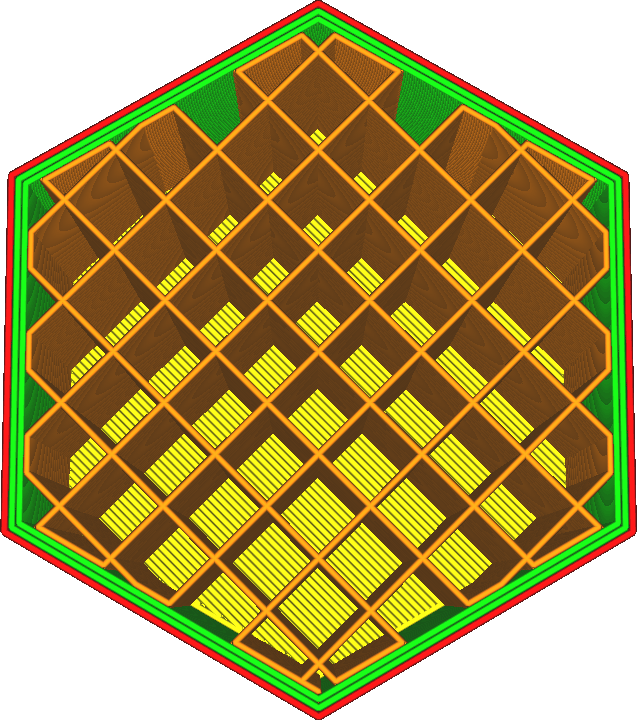
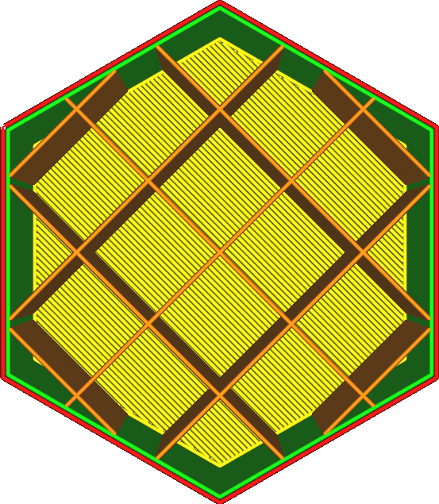

Fülldichte
====
Mit dieser Einstellung wird die Fülldichte des Drucks konfiguriert, die ein wichtiger Faktor für die Stärke des endgültigen Drucks und die Qualität der Oberfläche ist. Je höher die Fülldichte, desto dichter liegen die Fülllinien beieinander. Sie können sogar eine Dichte von über 100 % erreichen, aber das führt zu einer Überextrusion.

Unterschiedliche Fülldichten funktionieren bei verschiedenen Füllmuster besser. Füllmuster mit vielen Ecken und vielen Kreuzungen funktionieren bei hohen Fülldichten nicht gut. Ecken sind ein Problem, weil das Filament dazu neigt, Lufteinschlüsse an der Außenseite der Ecke zu bilden, wo das Material eigentlich abgelagert werden sollte. Kreuzungen sind ein noch größeres Problem, denn wenn eine Linie eine andere kreuzt, wird ihr Fluss unterbrochen, was zu Unterextrusion direkt nach der Kreuzung führt.

Eine Erhöhung der Fülldichte (durch Verringerung des Linienabstands) hat große Auswirkungen auf Ihren Druck, nämlich:
* Ihr Druck wird stabiler.
* Die Oberseite wird besser unterstützt, wodurch sie glatter und wasserdichter wird.
* Die Pillow-Effekte werden reduziert, da die Wärmeeinschlüsse kleiner sind.
* Ihr Druck benötigt mehr Material und ist daher schwerer.
* Es dauert länger, bis der Druck fertig ist.