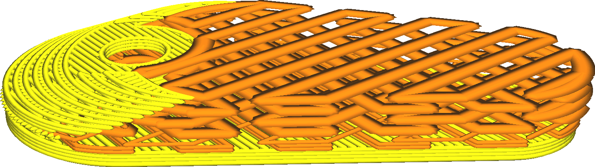

Füllschichtdicke
====
Da die Schichthöhe der Füllung für die optische Qualität nicht wichtig ist, können Sie dickere Schichten für die Füllung verwenden, um die Druckzeit zu verkürzen. Diese Einstellung bewirkt, dass die Schichten der Füllung miteinander kombiniert werden, sofern mehrere Schichten der Füllung direkt übereinander liegen. Bei einigen Schichten wird dann kein Füllmaterial gedruckt, aber dafür wird bei der höchsten der kombinierten Schichten mehr Material extrudiert, um dies auszugleichen.

In der Schichtansicht sieht es so aus, als ob die Fülllinien viel breiter geworden sind. Beim tatsächlichen Druck werden die Fülllinien nach unten fallen, anstatt sich horizontal auszubreiten.

Die Dicke der Füllschicht muss ein Vielfaches der Höhe der normalen Schicht sein. Ist dies nicht der Fall, wird sie auf die nächsthöhere Schicht gerundet.

* Seien Sie vorsichtig, bevor Sie die Schichtdicke zu stark erhöhen. Beim Wechsel zur und von der Füllung muss die Durchflussrate durch die Düse stark beschleunigt und verlangsamt werden. Dies geschieht mit einer gewissen Verzögerung, so dass am Anfang der Füllung zu wenig und am Ende der Füllung zu viel extrudiert wird.
* In den Zwischenschichten wird immer noch Füllmaterial mit einer geringeren Schichtdicke gedruckt, wenn in den umliegenden Schichten kein Füllmaterial vorhanden ist. Dies kann dazu führen, dass an schrägen Wänden kleine Linien der Füllung gedruckt werden.