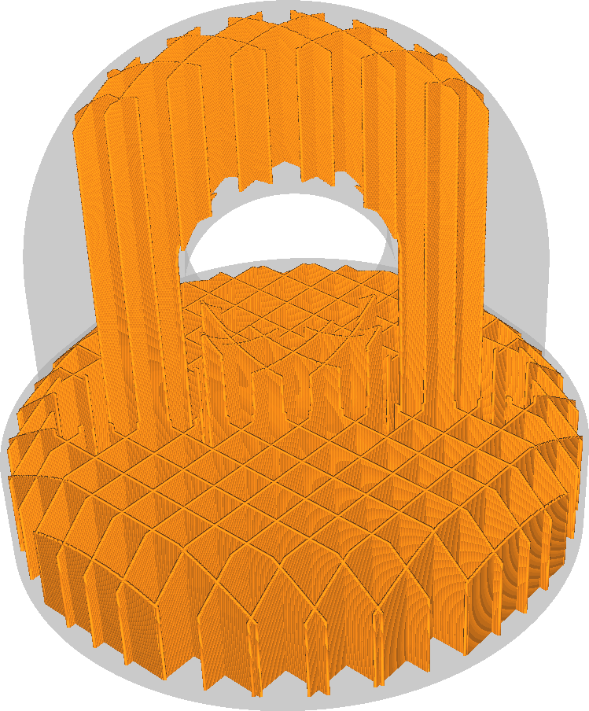
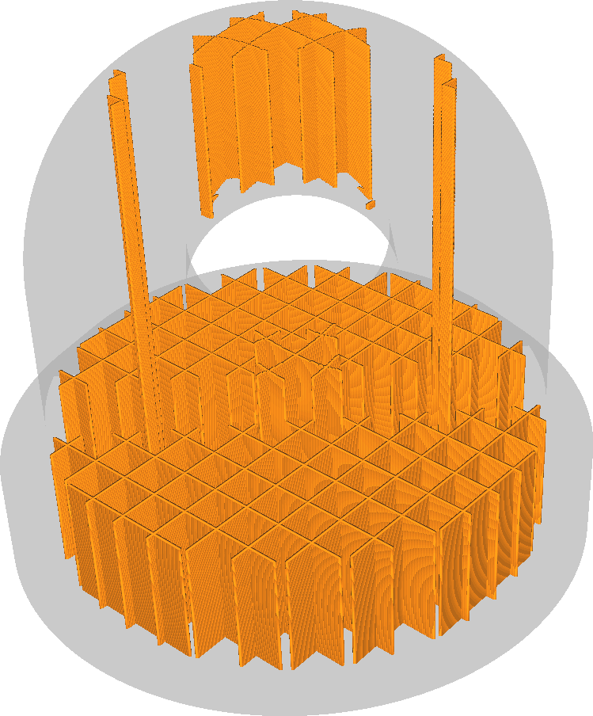

Füllung für Überhänge Stützstruktur
====
Bei Verwendung von Füllstruktur bestimmt diese Einstellung den minimalen Überhangwinkel der Oberfläche, die unterstützt werden muss. Dies ist vergleichbar mit der Einstellung [Überhangswinkel](../support/support_angle.md) für gewöhnliche Supports.

Eine Vergrößerung dieses Winkels führt dazu, dass die Füllung weniger von der Oberseite unterstützt wird. Dies spart Druckzeit und Material, führt aber dazu, dass die Außenhaut etwas stärker durchhängt.
* Ein Wert von 0° verhält sich wie eine normale Füllung. Er unterstützt alles.
* Bei einem Wert von 90° wird das gesamte Füllmaterial entfernt.