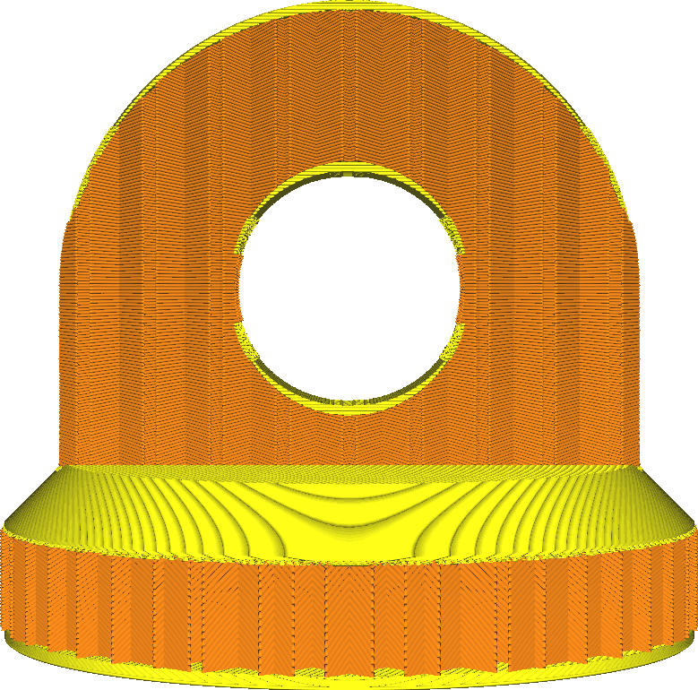
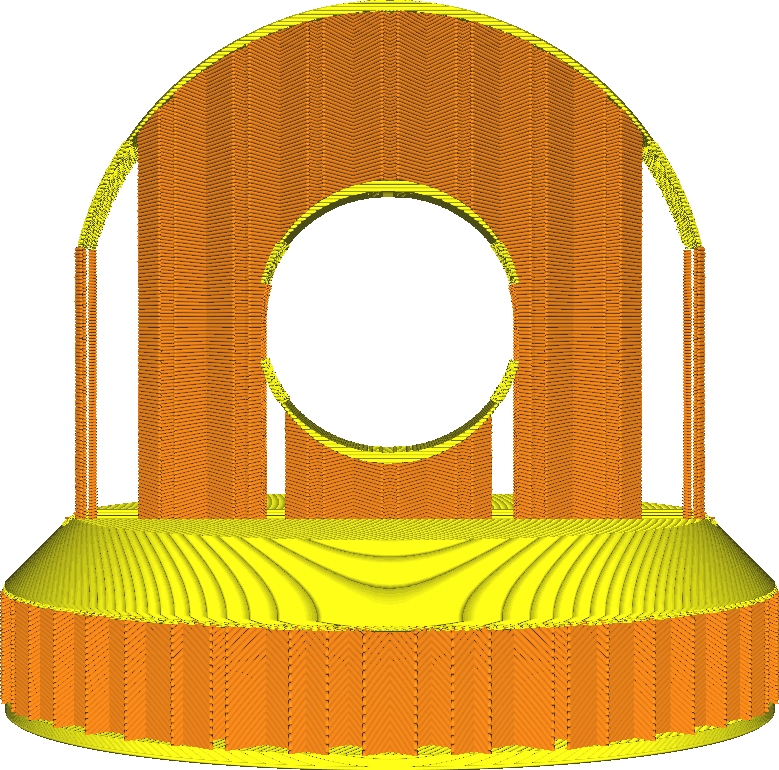

Füllstruktur
====
Wenn diese Funktion aktiviert ist, wird die Füllung als Support behandelt. Die Füllung wird dann nur dort erzeugt, wo sie benötigt wird, um die obere Fläche zu unterstützen. Es verhält sich so, als wäre das Modell hohl und würde im Inneren Unterstützung erzeugen, aber diese Unterstützung wird unter Verwendung der Füllungseinstellungen erzeugt.

* Dies spart eine Menge Material für die Füllung bei sehr geringen optischen Einbußen.
* Die Oberseiten können etwas mehr durchhängen, wenn diese Funktion aktiviert ist.
* Die horizontale Festigkeit der Füllung kann jedoch abnehmen. In vielen Fällen wird hinter den Wänden keine Füllung vorhanden sein, wenn die Wände Teil eines steilen Hangs sind.