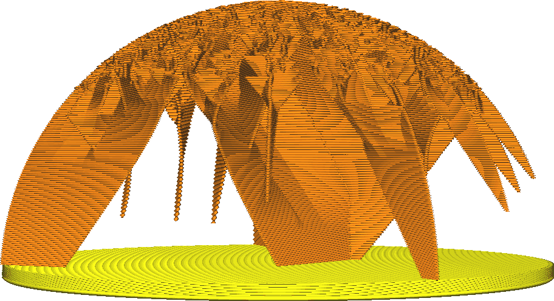
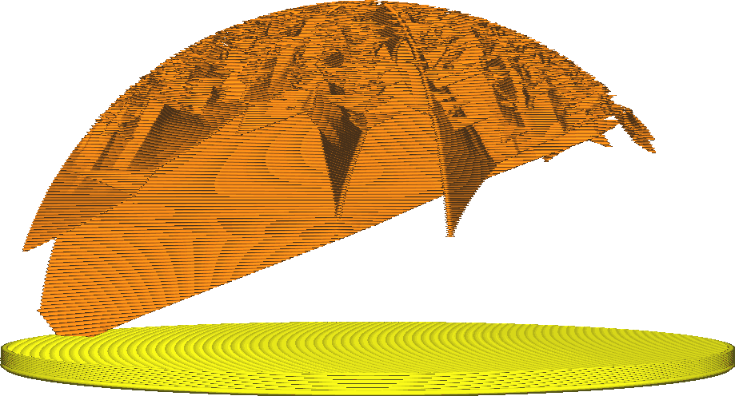

Blitz-Füllung Stutzwinkel
====
Das Füllmuster "Blitz" erzeugt auf der Innenseite des Drucks eine baumartige Struktur, die klein beginnt, sich aber verzweigt, um alle Teile des oberen Teils des Drucks zu erreichen, die von innen gestützt werden müssen. Diese Einstellung gibt an, wie weit die Äste des Baums an den Endpunkten überhängen können.

<!--screenshot {
"image_path": "lightning_infill_prune_angle_40.png",
"models": [{"script": "half_sphere.scad"}],
"camera_position": [112, 15, 9],
"settings": {
    "infill_pattern": "lightning",
    "wall_line_count": 0,
    "top_layers": 0,
    "lightning_infill_support_angle": 40,
    "lightning_infill_prune_angle": 40
},
"colours": 32
}-->
<!--screenshot {
"image_path": "lightning_infill_prune_angle_70.png",
"models": [{"script": "half_sphere.scad"}],
"camera_position": [112, 15, 9],
"settings": {
    "infill_pattern": "lightning",
    "wall_line_count": 0,
    "top_layers": 0,
    "lightning_infill_support_angle": 40,
    "lightning_infill_prune_angle": 70
},
"colours": 32
}-->

Eine Vergrößerung des Stutzwinkels bedeutet, dass die Füllung unten kleiner beginnen kann, aber dennoch die gesamte obere Fläche erreicht. In vielen Fällen muss sie nicht einmal mehr am Boden beginnen, sondern kann einfach an den Seiten angebracht werden. Die wichtigsten Auswirkungen einer Vergrößerung dieses Winkels sind:

* Geringere Druckzeit und geringerer Materialverbrauch.
* Glattere Wände, da nicht so viel Füllmaterial die Wände von innen berührt.
* Geringfügig geringere Festigkeit.
* Höhere Wahrscheinlichkeit von Druckfehlern. Wenn der Überhang zu steil ist, entsteht am Ende jeder Linie ein erheblicher Überhang, der durchhängt und sich lösen kann.

In der Praxis kann der Stutzwinkel höher sein als der normale Überhangwinkel oder die anderen Überhangwinkel der Blitz-Füllung. Da die Linien auf der darunter liegenden Schicht gut unterstützt werden, ist ein etwas größerer Überhang nicht wirklich ein Problem.