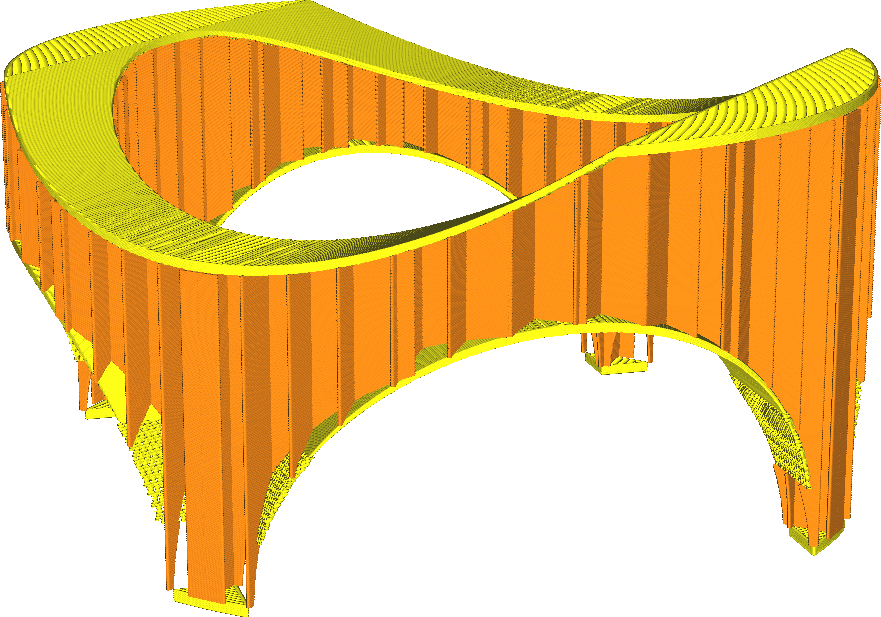
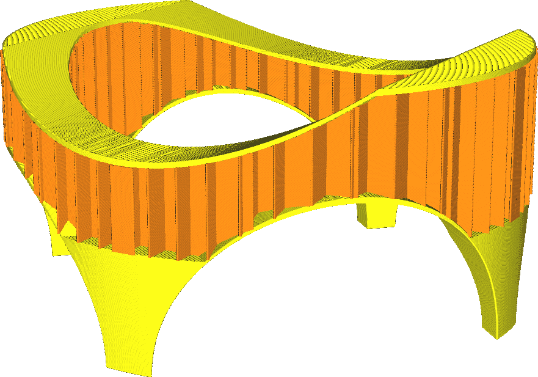

Mindestbereich Füllung
====
Diese Einstellung bewirkt, dass sehr kleine Teile mit dem Muster der Außenhaut und nicht mit dem Füllmuster gefüllt werden, wodurch sie in sich geschlossen sind.

Manchmal können sehr kleine hohle Bereiche nicht richtig mit Füllmaterial gefüllt werden, da die Fülllinien so kurz sind und dass das Material keine Zeit hat, richtig zu fließen. Diese Einstellung bewirkt, dass sie stattdessen mit Außenhaut gefüllt werden, was sie ebenfalls stärker macht und einen Abstand zwischen der Außenhaut und der Füllung verhindert.

Wenn Sie diese Einstellung auf 0 setzen, wird diese Funktion ausgeschaltet.