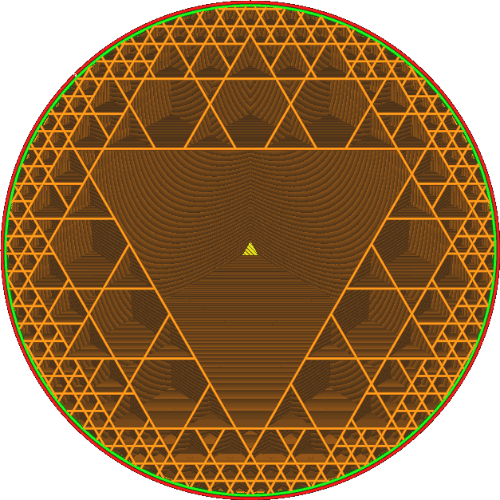
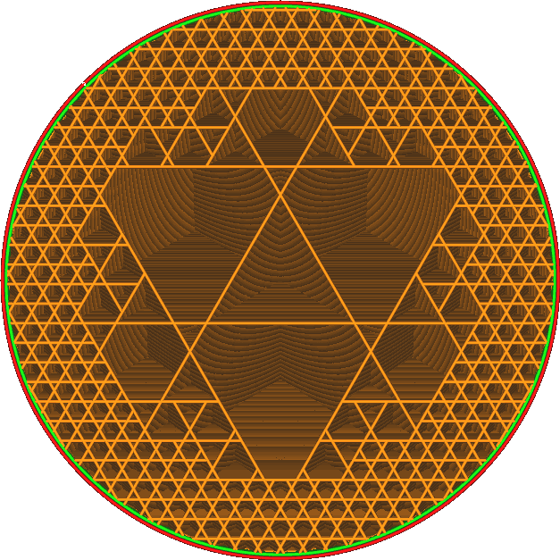

Gehäuse Würfel-Unterbereich
====
Diese Einstellung bewirkt, dass das Füllmuster des Würfel-Unterbereich nach innen hin etwas stärker reduziert wird, um die Festigkeit des Drucks zu verbessern.

Bei dem Würfel-Unterbereich werden die Grenzen zwischen acht benachbarten Würfeln entfernt, wenn keiner der Würfel die Grenze des Füllkörpers berührt. Mit dieser Einstellung wird diese Grenze weiter nach innen verschoben, so dass die Grenzen zwischen den Würfeln nicht entfernt werden.

Dies bewirkt, dass das Muster des Würfel-Unterbereich häufiger die maximale Dichte zeichnet. Dies erhöht die Festigkeit des Objekts, aber auch den Zeit- und Materialaufwand für den Druck. Im Extremfall führt eine Erhöhung dieser Einstellung dazu, dass das Würfel-Unterbereich dem einfachen Würfel Muster gleicht.

Sie können hier auch einen negativen Wert einstellen. Dies führt dazu, dass die Ränder zwischen den Würfeln häufiger entfernt werden, wodurch die Menge der Füllung an den Rändern effektiv reduziert wird.