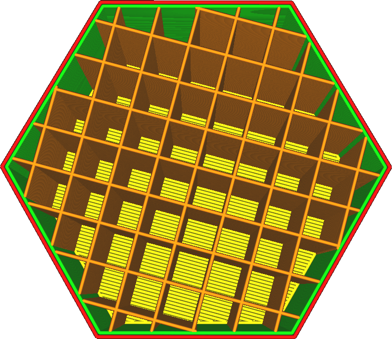
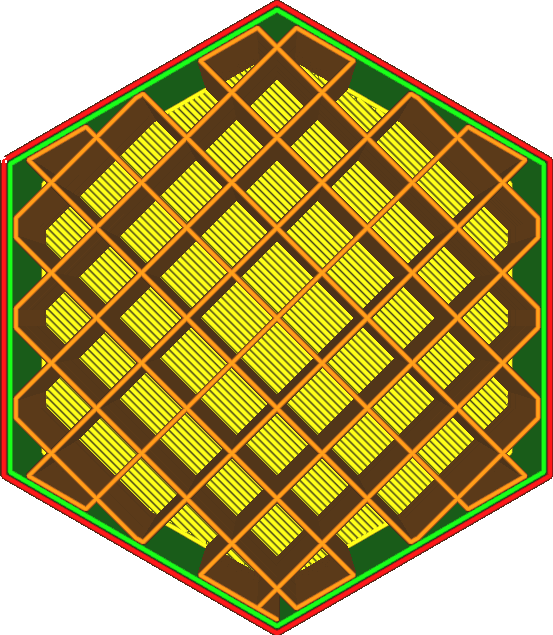

Füllungslinien verbinden
====
Diese Einstellung verbindet die Endpunkte des Füllmusters, an denen die Füllung auf die Innenwand oder Außenhaut trifft, durch eine Linie, die dem Rand des Füllbereichs folgt.

Damit wird das gesamte Füllmuster in eine einzige oder sehr wenige Linien umgewandelt. Die Umwandlung in eine einzige Linie ist nicht immer möglich. Der Anfangspunkt dieser Linie ist willkürlich, so dass er möglicherweise nicht für jede Schicht derselbe ist, insbesondere wenn die Form, in der die Füllung enthalten ist, sich von Schicht zu Schicht unterscheidet.

Das Verbinden der Füllung hat eine Reihe von Vorteilen, aber auch einige Nachteile:
* Ihr Teil wird am Ende stärker sein, da es praktisch eine halbe Kontur mehr hat.
* Die Füllung haftet aufgrund der größeren Oberfläche besser an den Wänden, was das Teil ebenfalls stabiler macht.
* Die Fließgeschwindigkeit wird konstanter gehalten, so dass Sie die Füllung mit höherer Geschwindigkeit ohne Fließprobleme drucken können. Dies ist besonders wichtig für Materialien, die sich nur schwer extrudieren lassen.
* Während des Druckens der Füllung wird deutlich weniger eingezogen, was ein Abschleifen des Materials verhindert.
* Die Wirkung der Einstellung [Füllung überlappen](infill_overlap.md) wird verstärkt, da ein größerer Teil der Fülllinien die Wände überlappen wird.
* Es wird mehr Material benötigt, um die Füllung zu drucken.
* Der Druck der Füllung nimmt in der Regel mehr Zeit in Anspruch, da die Fahrwege in der Regel schneller sind als der Druck der Füllungslinien.
* Die Füllung scheint in der Regel stärker durch die Wände hindurch, da sie in einen größeren Teil der Wände gedrückt wird.