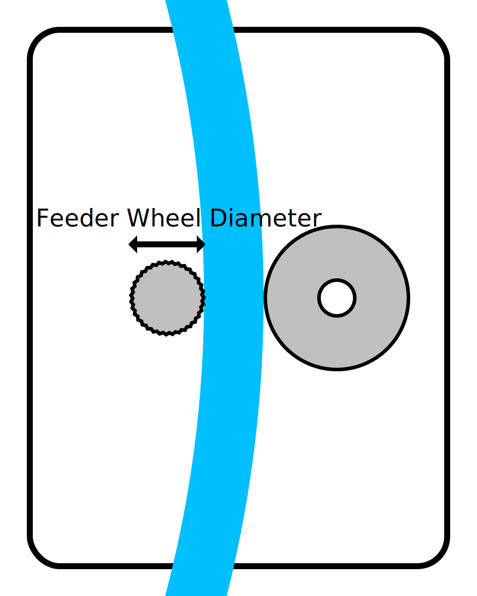

Feeder-Raddurchmesser
====
Diese Einstellung ist ein Maß für den Durchmesser des Rädchens, das das Filament in der Zuführung hin und her bewegt.

Diese Einstellung wird von Cura überhaupt nicht verwendet. Sie wird jedoch vom X3GWriter-Plugin verwendet, um die Zuführung korrekt zu steuern. Es muss wissen, wie schnell es den Feeder bewegen muss, um das Filament über die richtige Distanz zu bewegen.

**Da es sich um eine Maschineneinstellung handelt, ist diese Einstellung normalerweise nicht in der Einstellungsliste sichtbar.**